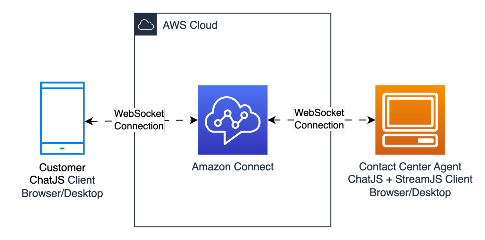
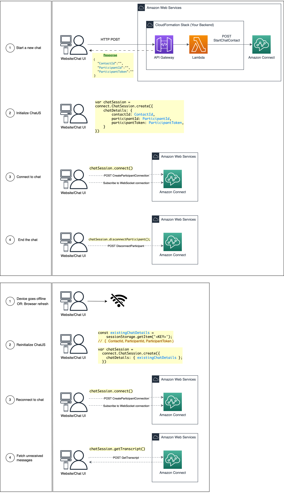
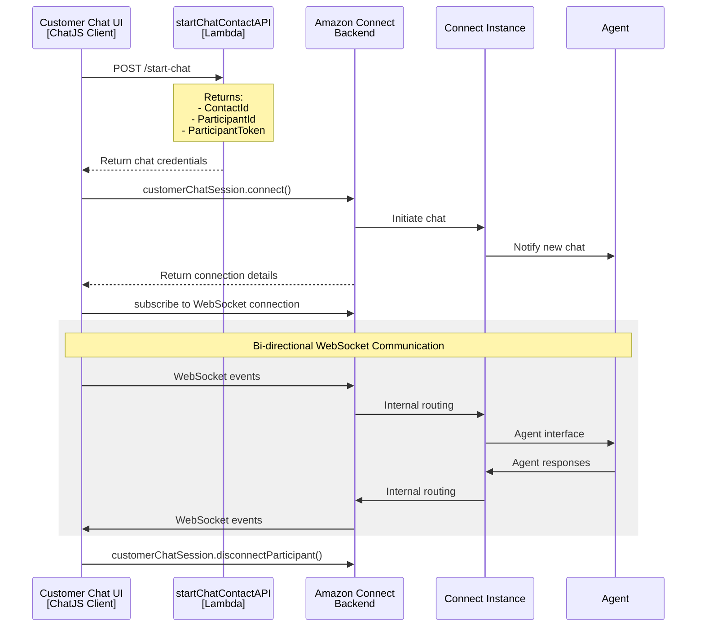
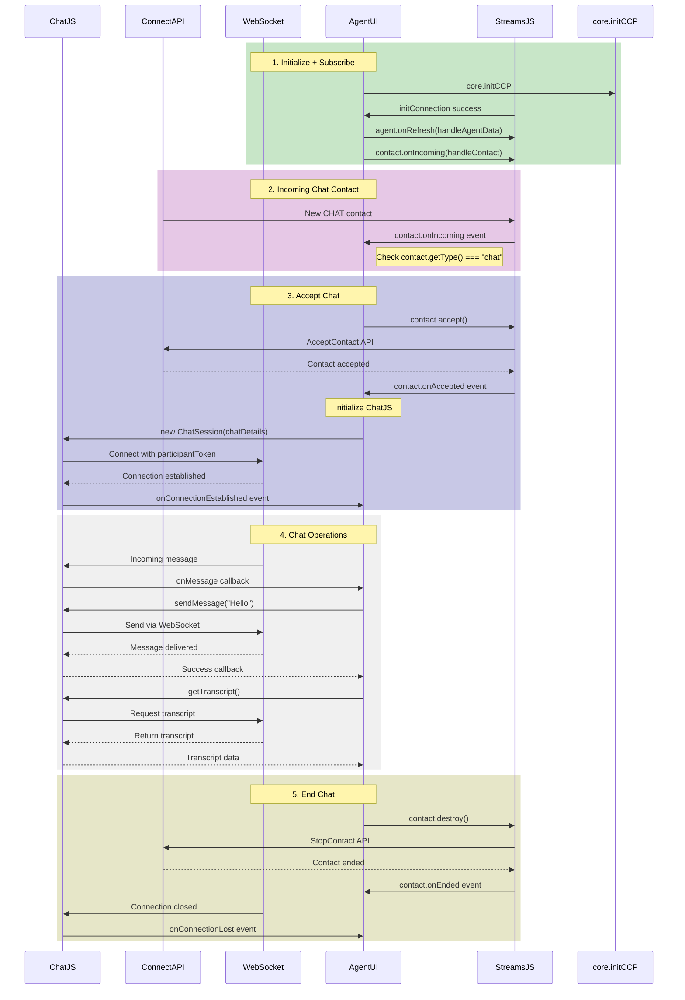

# Amazon Connect ChatJS

[](https://www.npmjs.com/package/amazon-connect-chatjs)  [](https://opensource.org/licenses/Apache-2.0) 

A browser-based JavaScript library to build custom chat interfaces for [Amazon Connect](https://docs.aws.amazon.com/connect/latest/adminguide/what-is-amazon-connect.html). Includes TypeScript support, fully managed WebSocket connections, and simplified API calls with internal AWS SDK integration. The Amazon Connect Chat javascript library (ChatJS) gives you the power to customize your chat experience and build your own chat widget or agent chat UI.

This stand-alone library supports customer chat sessions by default. For agent chat sessions and **Custom Contact Control Panel (CCP)**, please integrate with the [Amazon Connect Streams](https://github.com/aws/amazon-connect-streams) library.

> 📌 **New to Amazon Connect?**
> First, explore the [Amazon Connect User Guide](https://docs.aws.amazon.com/connect/latest/userguide/) to understand its features and capabilities. We recommend trying out the [pre-built Omnichannel Hosted Widget](https://docs.aws.amazon.com/connect/latest/adminguide/add-chat-to-website.html) (Voice, Chat, Video) before customizing with this library. For step-by-step guidance, check out our ["Getting Started with Amazon Connect Chat Open Source"](https://github.com/amazon-connect/amazon-connect-chat-ui-examples/blob/master/.github/docs/AmazonConnectChatOpenSourceWalkthrough.md) guide



## Table of Contents

- [Announcements](#announcements)
- [Examples](#examples)
- [Getting Started](#getting-started)
- [Usage](#usage)
  - [Customer Session](#customer-session)
  - [Agent Session](#agent-session)
- [API Reference](#api)
  - [Global Properties](#global-properties)
  - [ChatSession Class](#chatsession-class)
  - [`chatSession` Methods](#chatsession-methods)
  - [`chatSession` Events](#chatsession-events)
- [Feature Documentation](#features)
- [Local Development 💻](#local-development)
- [Known Issues and Debugging 🐛](#known-issues-and-debugging)
- [Troubleshooting and Support](#troubleshooting-and-support)

## 📢 Announcements

- **2025-05-29**: Migrated baked-in dependency from AWS SDK v2 to AWS SDK v3: `src/client/aws-sdk-connectparticipant.js`
- **2024-04-02**: Connection Acknowledgement (ConnAck) has migrated from [SendEvent](https://docs.aws.amazon.com/connect-participant/latest/APIReference/API_SendEvent.html) API to the [CreateParticipant](https://docs.aws.amazon.com/connect-participant/latest/APIReference/API_CreateParticipantConnection.html) API. Please upgrade to `amazon-connect-chatjs@^1.4.0` by **Dec 31, 2024**
- **2023-03-30**: v1.5.0 - Added support for _React Native environments_
- **2023-12-23**: v1.3.0 - Added Message Receipts feature, enabled by default
- **2022-11-08**: v1.2.0 - Added Client Side Metrics (CSM) feature, enabled by default
- **2020-12-13**: Added support for TypeScript (requires `typescript@^3.0.1` or higher)

## Examples

- **HTML Examples**
  - [Customer Chat UI](./examples/chatjs-customer.html)
  - [Agent Chat UI with StreamsJS](./examples/chatjs-streamsjs-agent.html)
- **React Examples**
  - [Customer Chat UI](https://github.com/amazon-connect/amazon-connect-chat-interface)
- **Mobile Examples**
  - [React Native Customer Chat UI](https://github.com/amazon-connect/amazon-connect-chat-ui-examples/tree/master/mobileChatExamples/connectReactNativeChat)
  - [Android Native Customer Chat UI](https://github.com/amazon-connect/amazon-connect-chat-ui-examples/tree/master/mobileChatExamples/androidChatExample)
  - [iOS Native Customer Chat UI](https://github.com/amazon-connect/amazon-connect-chat-ui-examples/tree/master/mobileChatExamples/iOSChatExample)

## Getting Started

### Prerequisites

- AWS Account
- [Amazon Connect instance](https://docs.aws.amazon.com/connect/latest/adminguide/amazon-connect-instances.html)
- Contact Flow ready to receive chat contacts (recommended: ["Sample inbound flow"](https://docs.aws.amazon.com/connect/latest/adminguide/sample-inbound-flow.html))
- Deploy a [startChatContactAPI](https://github.com/amazon-connect/amazon-connect-chat-ui-examples/tree/master/cloudformationTemplates/startChatContactAPI) CloudFormation stack

### Installation

```sh
npm install amazon-connect-chatjs
# or
yarn add amazon-connect-chatjs
# or
pnpm add amazon-connect-chatjs
```

### Importing ChatJS

This library supports ESModule (ES6) imports. This will make the `window.connect` variable available in the current context.

```js
import 'amazon-connect-chatjs';
```

### TypeScript Support

This package includes built-in TypeScript type definitions (requires `typescript@>=3.0.1`). No additional `@types` packages needed.

```typescript
import 'amazon-connect-chatjs'; // loads dist/index.d.ts
```
### Importing from CDN

```html
<!-- Using unpkg with semver range -->
<script src="https://unpkg.com/amazon-connect-chatjs@^3.0.0"></script>

<!-- Using unpkg with latest version -->
<script src="https://unpkg.com/amazon-connect-chatjs@latest"></script>

<!-- Using jsDelivr with specific version -->
<script src="https://cdn.jsdelivr.net/npm/amazon-connect-chatjs@3.0.6/dist/amazon-connect-chat.js"></script>

<!-- Using with CORS -->
<script crossorigin src="https://unpkg.com/amazon-connect-chatjs"></script>
```

### Using the AWS SDK and ChatJS

If your project also uses the AWS SDK, ensure you import ChatJS **before** the AWS SDK to prevent conflicts. This is because ChatJS includes its own bundled version of [AWS SDK for JavaScript V3](https://docs.aws.amazon.com/AWSJavaScriptSDK/v3/latest/) (in `src/client/aws-sdk-connectparticipant.js`).

```js
import 'amazon-connect-chatjs';
// Baked-in ChatJS dependency (AWS SDK v3)
// import { ConnectParticipantClient } from './client/aws-sdk-connectparticipant.js'; // v3.x.x

// Custom AWS SDK import, must be second
import { ConnectParticipantClient, StartAttachmentUploadCommand } from '@aws-sdk/client-connectparticipant'; // v3.x.x
// your code ...
```


### Configuration

Set the global configuration to use. This method should be called before `connect.ChatSession.create()`.
For all supported options, see [connect.ChatSession.create()](#connectchatsessionsetglobalconfig).

```js
connect.ChatSession.setGlobalConfig({
  region: "<AWS-REGION>", // (optional), defaults to: "us-west-2"
  loggerConfig: { // (optional)
    advancedLogWriter: null,
    customizedLogger: {
      debug: (...msg) => console.log(...msg),
      info: (...msg) => console.log(...msg),
      warn: (...msg) => console.log(...msg),
      error: (...msg) => console.log(...msg)
    },
    level: connect.ChatSession.LogLevel.INFO, // (optional), default 10 (DEBUG, INFO, WARN, ERROR, ADVANCED_LOG)
  },
  webSocketManagerConfig: { // (optional) for React Native environments
    isNetworkOnline: () => bool, // default: `() => navigator.onLine` (will break in React Native)
  },
  features: { // (optional)
    messageReceipts: {
      shouldSendMessageReceipts: true, // enabled by default, set to false to disable Read/Delivered receipts
      throttleTime: 5000 // default: 5000, customize time to wait before sending Read/Delivered receipts
    }
  },
  // Pass in a user agent suffix used to configure the AWS SDK client in Amazon Connect ChatJS.
  // This will be appended to the x-amz-user-agent custom header used in outgoing API requests
  customUserAgentSuffix: "", // (optional)
});
```

## Usage

### Customer Session

Create and join a new customer chat session.

To initialize ChatJS, you'll need chat details (`{ ContactId, ParticipantId, ParticipantToken }`) returned from a [StartChatContact](https://docs.aws.amazon.com/connect/latest/APIReference/API_StartChatContact.html) API request.

We recommend deploying this [startChatContactAPI](https://github.com/amazon-connect/amazon-connect-chat-ui-examples/tree/master/cloudformationTemplates/startChatContactAPI) CloudFormation stack for your chat proxy backend.

```typescript
import "amazon-connect-chatjs"; // imports the "window.connect"

connect.ChatSession.setGlobalConfig({ region: "us-west-2" });

// Step 1: Get chat details from your backend
// Boilerplate endpoint: https://github.com/amazon-connect/amazon-connect-chat-ui-examples/tree/master/cloudformationTemplates/startChatContactAPI
const response = await fetch("<url-to-personal-chat-backend>", { method: "POST" });
const chatDetails = await response.json();

// Step 2: Connect to the chat session
const customerChatSession = connect.ChatSession.create({
  chatDetails: {
    contactId: chatDetails.ContactId,
    participantId: chatDetails.ParticipantId,
    participantToken: chatDetails.ParticipantToken,
  },
  options: { region: "us-west-2" }, // optional
  type: "CUSTOMER",
  disableCSM: true
});
await customerChatSession.connect();

// Step 3: Send messages and events
await customerChatSession.sendMessage({ contentType: "text/plain", message: "Hello World!" });
await customerChatSession.sendEvent({ contentType: "application/vnd.amazonaws.connect.event.typing" });

// Step 4: Handle incoming websocket events
customerChatSession.onMessage(event => { /* ... */ });
customerChatSession.onConnectionBroken(event => { /* ... */ });
customerChatSession.onEnded(event => { /* ... */ });
customerChatSession.onTyping(event => { /* ... */ });
customerChatSession.onConnectionEstablished(event => { /* ... */ });

// Step 5: End chat gracefully
await customerChatSession.disconnectParticipant();
```

<details>
  <summary>📌 View: ChatJS Customer Session Diagaram</summary>

  
</details>

<details>
  <summary>📌 View: Customer Chat Sequence Diagaram</summary>


</details>

<details>
  <summary>📌 HTML Sample: ChatJS Customer Session</summary>

```html
<!DOCTYPE html>
<html>
<head>
  <meta charset="UTF-8">
  <!--
  Alternative import method:
  <script src="https://unpkg.com/amazon-connect-chatjs@3.0.3"></script>
  -->
</head>
<body>
  <div id="chat-container">
    <!-- Chat UI elements would go here -->
  </div>

  <script type="module">
    import "https://unpkg.com/amazon-connect-chatjs@3.0.3";
    const REGION = "us-west-2";

    window.onload = async function () {
      // Configure ChatJS
      connect.ChatSession.setGlobalConfig({ region: REGION });

      // Step 1: Get chat details from your backend
      const response = await fetch("<url-to-personal-chat-backend>", { method: "POST" });
      const chatDetails = await response.json();

      // Step 2: Connect to the chat session
      const customerChatSession = connect.ChatSession.create({
        chatDetails: {
          contactId: chatDetails.ContactId,
          participantId: chatDetails.ParticipantId,
          participantToken: chatDetails.ParticipantToken,
        },
        options: { region: REGION }, // optional
        type: "CUSTOMER",
        disableCSM: true
      });
      await customerChatSession.connect();

      // Step 3: Send messages and events
      // These would typically be triggered by user actions
      // await customerChatSession.sendMessage({ contentType: "text/plain", message: "Hello World!" });
      // await customerChatSession.sendEvent({ contentType: "application/vnd.amazonaws.connect.event.typing" });

      // Step 4: Handle incoming websocket events
      customerChatSession.onMessage(event => { /* ... */ });
      customerChatSession.onConnectionBroken(event => { /* ... */ });
      customerChatSession.onEnded(event => { /* ... */ });
      customerChatSession.onTyping(event => { /* ... */ });
      customerChatSession.onConnectionEstablished(event => { /* ... */ });

      // Step 5: End chat gracefully
      // This would typically be triggered by a user action
      // await customerChatSession.disconnectParticipant();
    };
  </script>
</body>
</html>
```
</details>

### Agent Session

For agent chat sessions and **Custom Custom Contact Control Panel (CCP)**, please integrate **ChatJS** with the [Amazon Connect Streams](https://github.com/aws/amazon-connect-streams) library.

StreamJS will provide the ChatJS `agentChatSession` via `agentConnection.getMediaController()`. This supports the same event listeners and methods as customer chat sessions, with the exception of `disconnectParticipant()`.

> **Note:** for **Custom CCP**, you must to allow-list your domain before using StreamsJS, including `http://localhost:PORT` for local testing. More [details here](https://github.com/amazon-connect/amazon-connect-streams?tab=readme-ov-file#allowlisting). Update your instance settings in the Amazon Connect AWS Console.

```html
<html>
<!-- OPTIONAL: hide the pre-built CCP UI
<style>#ccp-iframe-root iframe{display:none}</style>
-->
<body>
  <div id="ccp-iframe-root"></div>
  <script type="module">
    import 'https://unpkg.com/amazon-connect-streams@2.18.3';  // StreamJS must be imported first

    // To allow-list your domain, see: https://github.com/amazon-connect/amazon-connect-streams#allowlisting
    const INSTANCE_URL = "https://<INSTANCE_NAME>.my.connect.aws/ccp-v2/";
    const REGION = '<AWS-REGION>'; // "us-west-2"

    // Step 1: Initialize CCP
    // <div id="ccp-iframe-root" />
    var containerElement = document.getElementById("ccp-iframe-root");
    await connect.core.initCCP(containerElement, {
      ccpUrl: INSTANCE_URL,
      region: REGION,
      loginPopup: true,
    });

    // Step 2: Handle incoming chat contacts
    connect.contact((contact) => {
      if (contact.getType() !== connect.ContactType.CHAT) return;
      // Auto-accept the incoming chat contact
      contact.accept();

      contact.onAccepted(async () => {
        const agentConnection = contact.getConnections().find(conn => conn.getType() === connect.ConnectionType.AGENT);

        // Configure ChatJS (optional)
        connect.ChatSession.setGlobalConfig({ /* ... */ });

        // Step 3: Initialize ChatJS and subscribe to WebSocket connection
        const agentChatSession = await agentConnection.getMediaController();

        // Fetch the transcript
        const awsSDKResponse = await agentChatSession.getTranscript({
          sortOrder: "ASCENDING",
          maxResults: 100, // default: 15
          metadata: { foo: "bar" }, // optional
          // scanDirection: "BACKWARD", (optional) default: BACKWARD
          // nextToken?: nextToken - OPTIONAL, for pagination
        });
        const { InitialContactId, NextToken, Transcript } = awsSDKResponse.data;

        // Set up event listeners
        agentChatSession.onConnectionEstablished((event) => {
          // Handle connection established
        });

        agentChatSession.onMessage((event) => {
          const message = event.data?.Content;
          // Handle incoming message
        });

        // Send messages
        await agentChatSession.sendMessage({ contentType: "text/plain", message: "Hello World!" });

        // NOTE: disconnectParticipant() is not available in agentChatSession
        // To leave an agent chat session, run:
        // contact.destroy()
      });
    });
  </script>
</body>
</html>
```

<details>
  <summary>📌 HTML Sample: Agent Custom CCP w/ ChatJS and StreamsJS</summary>

```html
<!-- chatjs-streamsjs-example.html -->
<!--
# Amazon Connect Custom Agent Chat UI

## Overview
Custom Agent Chat UI integrating ChatJS and StreamsJS for Amazon Connect Chat

- StreamsJS: https://github.com/amazon-connect/amazon-connect-streams
- ChatJS: https://github.com/amazon-connect/amazon-connect-chatjs
- AWS Documentation: https://docs.aws.amazon.com/connect/latest/adminguide/chat-with-connect-contacts.html

## Prerequisites
- Amazon Connect Instance
- Access to Agent Contact Control Panel (CCP): https://<instance-alias>.my.connect.aws/ccp-v2
  - Requires: Security Profile = "CCP: Access CCP"

## Configuration Steps
1. Allowlisting
   - Login to your AWS Account, then navigate to the Amazon Connect console.
   - Click the instance name of the instance for which you would like to allowlist pages to load the settings page for your instance.
   - Click the "Application integration" link on the left.
   - Click "Add Origin", then enter a domain URL: http://localhost:8080

2. Configuration Updates
   - Update the following values in the script:
     * `INSTANCE_URL`: Your Amazon Connect instance URL
     * `REGION`: Your AWS region

## Local Testing Instructions
1. Host the HTML file in a local browser
   ``
   npx live-server --port=8080 chatjs-streamsjs-example.html
   ``
   - Access URL: http://localhost:8080

2. Login Process
   - Open Contact Control Panel (CCP)
   - Login with your Agent username/password

3. Chat Interaction
   - Keep CCP tab open
   - In a second browser tab, launch Amazon Connect Test Chat Page: https://<instance-alias>.my.connect.aws/test-chat
   - Open the Customer widget
   - Back on CCP tab, wait for an incoming chat contact, click "Accept"
-->
<!DOCTYPE html>
<html>

<head>
  <meta charset="UTF-8">
  <title>Agent Chat UI [Amazon Connect]</title>
  <style>
    body {
      display: flex;
    }

    #prebuilt-agent-ui-iframe,
    #chat-ui-container {
      width: 400px;
      height: 800px;
    }

    #chat-ui-container {
      font-family: Arial, sans-serif;
      border: 1px solid #ddd;
      padding: 15px;
      border-radius: 5px;
      margin: 20px auto;
    }

    #custom-agent-chat-transcript {
      height: 300px;
      overflow-y: auto;
      background-color: #f8f8f8;
      padding: 10px;
      margin-top: 20px;
      width: 100%;
      box-sizing: border-box;
    }

    #custom-agent-chat-transcript::after {
      content: "";
      display: table;
      clear: both;
    }

    .message {
      margin: 5px 0;
      padding: 8px;
      border-radius: 5px;
      max-width: 80%;
      word-wrap: break-word;
      clear: both;
    }

    .incoming-message {
      background-color: #f0f0f0;
      border: 1px solid #ddd;
      float: left;
      text-align: left;
    }

    .outgoing-message {
      background-color: #0084ff;
      color: white;
      border: 1px solid #0073e6;
      float: right;
      text-align: right;
    }

    #message-input-container {
      display: flex;
      margin-top: 15px;
    }

    #messageInput {
      flex-grow: 1;
      margin-right: 5px;
      padding: 8px;
      border: 1px solid #ccc;
      border-radius: 4px;
    }

    button {
      padding: 8px 15px;
      border-radius: 4px;
      cursor: pointer;
      background-color: #0084ff;
      color: white;
      border: none;
    }

    button:disabled {
      background-color: #ccc;
    }
  </style>
</head>

<body>
  <div id="prebuilt-agent-ui-iframe"></div>
  <div id="chat-ui-container">
    <h3>Custom Agent Chat UI (ChatJS + StreamsJS)</h3>
    <div id="custom-agent-chat-transcript"></div>
    <div id="message-input-container" style="display: none">
      <input type="text" id="messageInput" placeholder="Type your message..." disabled>
      <button id="sendMessageButton" disabled>Send</button>
    </div>
  </div>

  <script type="module">
    // Option 1: import ChatJS and StreamJS directly from npm (order is important)
    import "https://unpkg.com/amazon-connect-streams@2.18.1"; // imports `window.connect.*`
    import "https://unpkg.com/amazon-connect-chatjs@3.0.5"; // also imports `window.connect.*`

    // Option 2: Import bundle files
    // import "amazon-connect-streams.js";
    // import "amazon-connect-chat.js";

    const INSTANCE_URL = "https://{INSTANCE-ALIAS}.my.connect.aws/ccp-v2?visual-refresh=true";
    const REGION = 'us-west-2';
    const MAX_TRANSCRIPT_MESSAGES = 15;

    window.onload = async function () {
      // DOM element references
      const elements = {
        prebuiltAgentUI: document.getElementById("prebuilt-agent-ui-iframe"),
        transcript: document.getElementById("custom-agent-chat-transcript"),
        messageInput: document.getElementById("messageInput"),
        sendButton: document.getElementById("sendMessageButton"),
        inputContainer: document.getElementById("message-input-container"),
      };

      // Initialize Connect CCP and set up handlers
      await connect.core.initCCP(elements.prebuiltAgentUI, {
        ccpUrl: INSTANCE_URL,
        region: REGION,
        loginPopup: true,
      });

      connect.ChatSession.setGlobalConfig({
        loggerConfig: { useDefaultLogger: true },
        region: REGION,
      });

      // Handle new contacts
      connect.contact(contact => {
        if (contact.getType() === connect.ContactType.CHAT) {
          // Automatically accept chat
          contact.accept();
        }

        contact.onAccepted(() => initializeChatContact(contact));
      });

      // Check for existing contacts
      connect.agent(agent => {
        agent.onRefresh(() => {
          agent.getContacts().forEach(contact => {
            const contactStatus = contact.getStatus().type;
            const isActiveChat =
              contact.getType() === connect.ContactType.CHAT &&
              (contactStatus === connect.ContactStateType.CONNECTED ||
                contactStatus === connect.ContactStateType.ACCEPTED);

            if (isActiveChat) initializeChatContact(contact);
          });
        });
      });

      /**
       * Initialize a chat contact and set up the UI
       */
      async function initializeChatContact(contact) {
        if (contact.getType() !== connect.ContactType.CHAT) return;

        const agentConnection = contact.getConnections().find(
          conn => conn.getType() === connect.ConnectionType.AGENT
        );

        let chatSession;
        try {
          chatSession = await agentConnection.getMediaController();

          if (!chatSession) {
            chatSession = connect.ChatSession.create({
              chatDetails: agentConnection.getMediaInfo(),
              options: { region: REGION },
              type: connect.ChatSession.SessionTypes.AGENT,
              websocketManager: connect.core.getWebSocketManager()
            });
            await chatSession.connect();
          }

          // To end an Agent Chat Session, equiv to customerChatSession.disconnectParticipant()
          // await contact.destroy({
          //     success: () => console.log("Contact ended successfully"),
          //     failure: (err) => console.error("Failed to end contact:", err)
          // });

          setupChat(chatSession, elements);
        } catch (error) {
          console.error('Error getting chat session:', error);
        }
      }

      /**
       * Set up the chat UI and handlers
       */
      function setupChat(chatSession, elements) {
        if (!chatSession) return;

        // Show and enable UI elements
        elements.transcript.style.display = "block";
        elements.transcript.style.visibility = "visible";
        elements.inputContainer.style.display = "flex";
        elements.messageInput.disabled = false;
        elements.sendButton.disabled = false;

        // Set up message sending
        const sendMessage = async () => {
          const message = elements.messageInput.value.trim();
          if (message) {
            try {
              await chatSession.sendMessage({ contentType: "text/plain", message });
              elements.messageInput.value = '';
            } catch (error) {
              console.error('Error sending message:', error);
            }
          }
        };

        elements.sendButton.addEventListener('click', sendMessage);
        elements.messageInput.addEventListener('keypress', e => {
          if (e.key === 'Enter') sendMessage();
        });

        // Set up chat session handlers
        chatSession.onConnectionEstablished(() => {
          // Load previous messages
          chatSession.getTranscript({
            scanDirection: "BACKWARD",
            sortOrder: "ASCENDING",
            maxResults: MAX_TRANSCRIPT_MESSAGES
          }).then(response => {
            if (response.data?.Transcript) {
              response.data.Transcript.forEach(msg => renderMessage(msg, chatSession, elements));
            }
          }).catch(error => console.error("Error loading transcript:", error));
        });

        /**
         * Subscribes an event handler that triggers whenever a message or an event (except for `application/vnd.amazonaws.connect.event.typing`) is created by any participant.
         * @param {
            chatDetails: Object,
            data: {
              AbsoluteTime: string,
              Content?: string,
              ContentType: string,
              DisplayName?: string,
              Id: string,
              ParticipantId?: string,
              ParticipantRole?: "AGENT" | "CUSTOMER" | "SYSTEM",
              Type: "MESSAGE" | "EVENT" | "ATTACHMENT" | "CONNECTION_ACK",
              ContactId?: string,
              InitialContactId?: string
            }
        } event
        */
        chatSession.onMessage(event => {
          if (event.data) renderMessage(event.data, chatSession, elements);
        });

        /**
         * Subscribes an event handler that triggers whenever a "application/vnd.amazonaws.connect.event.typing" event is created by any participant.
         * @param {
            AbsoluteTime?: string,
            ContentType: "application/vnd.amazonaws.connect.event.typing",
            Type?: string,
            ParticipantId?: string,
            DisplayName?: string,
            ParticipantRole?: "AGENT" | "CUSTOMER" | "SYSTEM",
            InitialContactId?: string
        } event.data
        */
        chatSession.onTyping((event) => {
          // Handle typing indicator
          renderMessage({
            "AbsoluteTime": "2025-05-23T06:01:24.287Z",
            "ContentType": "text/plain",
            "Content": "...",
            "Id": "e69634e9-2b31-4598-923e-5b2be62d436b",
            "Type": "EVENT",
            "ParticipantId": "5b370166-c0ee-4e23-ac1b-87ceffa611c4",
            "DisplayName": "Customer",
            "ParticipantRole": "CUSTOMER",
            "InitialContactId": "3358be3e-368d-4cde-ae92-352f44c35440"
          }, chatSession, elements);
        })

        /**
         * Subscribes an event handler that triggers when a read message event is received from the customer or agent.
         * @param {
            AbsoluteTime?: string,
            ContentType: "application/vnd.amazonaws.connect.event.message.read",
            Type?: string,
            ParticipantId?: string,
            DisplayName?: string,
            ParticipantRole?: "AGENT" | "CUSTOMER" | "SYSTEM",
            InitialContactId?: string
         } event.data
         */
        chatSession.onReadReceipt((event) => {
          // handle message receipt
        })

        /**
         * Subscribes an event handler that triggers when a delivered message event is received from the customer or agent.
         * @param {
            AbsoluteTime?: string,
            ContentType: "application/vnd.amazonaws.connect.event.message.delivered",
            Type?: string,
            ParticipantId?: string,
            DisplayName?: string,
            ParticipantRole?: "AGENT" | "CUSTOMER" | "SYSTEM",
            InitialContactId?: string
         } event.data
         */
        chatSession.onDeliveredReceipt((event) => {
          // handle message receipt
        })
      }

      /**
       * Render a message in the chat UI
       */
      function renderMessage(message, chatSession, elements) {
        if (message.ContentType === "text/plain" || message.ContentType === "text/markdown") {
          const messageElement = document.createElement("div");
          messageElement.className = "message";

          const isFromAgent = message.ParticipantId === chatSession.getChatDetails().participantId;
          messageElement.classList.add(isFromAgent ? "outgoing-message" : "incoming-message");

          const displayName = message.DisplayName || (isFromAgent ? 'Agent' : 'Customer');
          const content = document.createElement("div");
          const messageContent = message.Content || message.content;
          content.textContent = `${displayName}: ${messageContent}`;
          messageElement.appendChild(content);

          messageElement.id = `msg-${message.Id}`;
          messageElement.title = new Date(message.AbsoluteTime).toLocaleTimeString();

          elements.transcript.appendChild(messageElement);
          elements.transcript.scrollTop = elements.transcript.scrollHeight;
        }
      }
    };
  </script>
</body>

</html>
```
</details>


<details>
  <summary>📌 View: Agent Chat Sequence Diagaram</summary>


</details>

## API

- [Global Properties](#global-properties)
- [ChatSession Class](#chatsession-class)
- [`chatSession` Methods](#chatsession-methods)
- [`chatSession` Events](#chatsession-events)

### Global Properties

#### `window.connect.ChatSession`

```js
window.connect.ChatSession = {
  create: ({ /* ... */ }) => {},
  setGlobalConfig: (config) => {},
  LogLevel: { /* ... */ },
  Logger: { /* ... */ },
  SessionTypes: { /* ... */ },
};
```
This is the main entry point to `amazon-connect-chatjs`.
All your interactions with the library start here.

#### `window.connect.ChatSession.LogLevel`

```js
connect.ChatSession.LogLevel = {
  DEBUG,
  INFO,
  WARN,
  ERROR,
  ADVANCED_LOG,
};
```
Enumerates the logging levels.

<!--
#### `window.connect.csmService` [INTERNAL ONLY]

```js
const csmService = window.connect.csmService;

// Example usage
csmService.initializeCSM();
csmService.updateCsmConfig({ widgetType: "CustomChatWidget" })
csmService.addCountAndErrorMetric(metricName, "UI" || "API", error=false);
csmService.addCountMetric(method, "UI" || "API");
// ...
```
Used for publishing client-side-metrics (CSM) to track API metrics (count, latency, error count). Only applies to `CustomerChatSession`.

Used internally and safe to disable: `connect.ChatSession.create({ ..., disableCSM: true })`. ChatJS will functionally normally without CSM.
-->

### ChatSession Class

#### `connect.ChatSession.create()`

```js
const chatSession = await connect.ChatSession.create({
  chatDetails: {
    contactId: "...", // REQUIRED
    participantId: "...", // REQUIRED
    participantToken: "...", // REQUIRED
  },
  options: {
    region: "us-east-1", // (optional) defaults to `region` set in `.setGlobalConfig()`
  },
  type: window.connect.ChatSession.SessionTypes.CUSTOMER, // REQUIRED - options: `CUSTOMER`, `AGENT`
  disableCSM: true
});
```

`ContactId`, `ParticipantId`, and `ParticipantToken` must be generated on your backend and passed to the client. Make a request to [StartChatContact](https://docs.aws.amazon.com/connect/latest/APIReference/API_StartChatContact.html) API (see [#Usage](#usage-customer-chat)) for more details.

#### `connect.ChatSession.setGlobalConfig()`

```js
connect.ChatSession.setGlobalConfig({
  // AWS Region (optional, defaults to "us-west-2")
  region: "<AWS-REGION>",

  // Logger Configuration (optional)
  loggerConfig: {
    advancedLogWriter: null,
    customizedLogger: {
      debug: (...msg) => console.log(...msg),
      info: (...msg) => console.log(...msg),
      warn: (...msg) => console.log(...msg),
      error: (...msg) => console.log(...msg)
    },
    // Log levels: DEBUG, INFO, WARN, ERROR, ADVANCED_LOG
    level: connect.ChatSession.LogLevel.INFO
  },

  // WebSocket Manager Config (optional, for React Native environments)
  webSocketManagerConfig: {
    // Default: `() => navigator.onLine` (will break in React Native)
    isNetworkOnline: () => bool
  },

  // Features Configuration (optional)
  features: {
    messageReceipts: {
      // Enable/disable Read/Delivered receipts (enabled by default)
      shouldSendMessageReceipts: true,
      // Time to wait before sending Read/Delivered receipts (default: 5000ms)
      throttleTime: 5000
    }
  },

  // User agent suffix for AWS SDK client (optional)
  // Appended to x-amz-user-agent custom header in API requests
  customUserAgentSuffix: ""
});
```
Set the global configuration to use. If this method is not called, the defaults of loggerConfig and region are used. This method should be called before `connect.ChatSession.create()`.

#### `connect.ChatSession.Logger`

```js
connect.ChatSession.Logger = {
    debug(data) {}
    info(data) {}
    warn(data) {}
    error(data) {}
    advancedLog(data) {}
}
const logger = connect.ChatSession.Logger;
logger.info('foobar')
// INFO [2025-04-08T03:29:35.423Z] ChatJS: foobar
```
Exposes the internal ChatJS logger. Group your logs and use consistent format for easier debugging.

#### `connect.ChatSession.SessionTypes`

```js
connect.ChatSession.SessionTypes = {
  AGENT,
  CUSTOMER,
};
```
Enumerates the session types.

### `chatSession` Methods

Amazon Connect [Participant Service API](https://docs.aws.amazon.com/connect/latest/APIReference/API_Operations_Amazon_Connect_Participant_Service.html) wrappers

> ##### Metadata Usage
>
> - Most functions accept an optional `metadata` argument
> - `metadata` is not used by `amazon-connect-chatjs` internally
> - The `metadata` value is copied to the response object
> - Developers can use `metadata` for their own purposes
>
> Example:
> ```js
> chatSession.getTranscript({ metadata: "foo" })
>   .then(({ data, metadata }) => {
>     console.log(metadata); // "foo"
>   })
>   .catch(({ error, metadata}) => {
>      console.error(metadata); // "foo"
>   })
> ```

#### `chatSession.connect()`

```js
const { connectCalled, connectSuccess } = await chatSession.connect();
// connectCalled: indicates whether the Amazon Connect Participant Service was called
// connectSuccess: indicates whether the operation succeeded
```
Wraps the [CreateParticipantConnection](https://docs.aws.amazon.com/connect/latest/APIReference/API_connect-participant_CreateParticipantConnection.html) API.

**Note:** If the operation fails, the Promise will reject, but the error will have the same schema as a successful response.

#### `chatSession.sendMessage()`

```js
const awsSdkResponse = await chatSession.sendMessage({
  contentType: "text/plain",
  message: "Hello World!",
  metadata: { foo: "bar" }, // optional
});
const { AbsoluteTime, Id, MessageMetadata } = awsSdkResponse.data;
const metadata = awsSdkResponse.metadata;
```

Wraps the [SendMessage](https://docs.aws.amazon.com/connect-participant/latest/APIReference/API_SendMessage.html) API.

The arguments are based on the [API request body](https://docs.aws.amazon.com/connect-participant/latest/APIReference/API_SendMessage.html#API_SendMessage_RequestSyntax) with the following differences:

- Fields are in `camelCase`.
- `ClientToken` cannot be specified.

The response `data` is the same as the [API response body](https://docs.aws.amazon.com/connect-participant/latest/APIReference/API_SendMessage.html#API_SendMessage_ResponseSyntax).

#### `chatSession.getTranscript()`

```js
const awsSDKResponse = await chatSession.getTranscript({
    sortOrder: "ASCENDING",
    maxResults: 100, // default: 15
    metadata: { foo: "bar" }, // optional
    // scanDirection: "BACKWARD", (optional) default: BACKWARD
    // nextToken?: nextToken - OPTIONAL, for pagination
});
const { InitialContactId, NextToken, Transcript } = awsSDKResponse.data;
// see: https://docs.aws.amazon.com/connect/latest/APIReference/API_connect-participant_GetTranscript.html#API_GetTranscript_ResponseSyntax
```
Fetch the chat transcript (uses ConnectionToken). Wraps the [GetTranscript](https://docs.aws.amazon.com/connect-participant/latest/APIReference/API_GetTranscript.html) API

> **Important note:** In order to specify `scanDirection` as `FORWARD`, you need to explicitly include a `startPosition`.
This is because the default `startPosition` is at the most recent update to the transcript, so requesting a transcript in the `FORWARD` direction from the default `startPosition` is equivalent to asking for a transcript containing only messages more recent than the present (you are asking for messages in the future!).

#### `chatSession.sendEvent()`

```js
const awsSdkResponse = await chatSession.sendEvent({
  contentType: "application/vnd.amazonaws.connect.event.typing",
  metadata: { foo: "bar" }, // optional
});
const { AbsoluteTime, Id } = awsSdkResponse.data;
```

Wraps the [SendEvent](https://docs.aws.amazon.com/connect-participant/latest/APIReference/API_SendEvent.html) API.

The arguments are based on the [API request body](https://docs.aws.amazon.com/connect-participant/latest/APIReference/API_SendEvent.html#API_SendEvent_RequestSyntax) with the following differences:


- Fields are in `camelCase`.
- `ClientToken` cannot be specified.
- `ContentType` allows the following values:
  - `"application/vnd.amazonaws.connect.event.typing"`
  - `"application/vnd.amazonaws.connect.event.connection.acknowledged"`
  - `"application/vnd.amazonaws.connect.event.message.delivered"`
  - `"application/vnd.amazonaws.connect.event.message.read"`
  - `"application/vnd.amazonaws.connect.event.participant.invited"`

The response `data` is the same as the [API response body](https://docs.aws.amazon.com/connect-participant/latest/APIReference/API_SendEvent.html#API_SendEvent_ResponseSyntax).

#### `chatSession.sendAttachment()`

> Important: an administrator must [enable attachments](https://docs.aws.amazon.com/connect/latest/adminguide/enable-attachments.html) for your Connect instance

```js
await chatSession.sendAttachment({
  attachment: attachment // type: File [HTML file object, see https://developer.mozilla.org/en-US/docs/Web/API/File]
  metadata: { foo: "bar" }, // optional
});
// supported files: .csv, .doc, .docx, .jpeg, .jpg, .pdf, .png, .ppt, .pptx, .txt, .wav, .xls, .xlsx
// max size: 20MB
// source: https://docs.aws.amazon.com/connect/latest/adminguide/feature-limits.html#feature-limits-chat

// Example usage
var input = document.createElement('input');
input.type = 'file';
input.addEventListener('change', (e) => {
  const file = e.target.files[0];
  chatSession.sendAttachment({ attachment: file })
});
```
Wraps the [StartAttachmentUpload](https://docs.aws.amazon.com/connect-participant/latest/APIReference/API_StartAttachmentUpload.html) and [CompleteAttachmentUpload](https://docs.aws.amazon.com/connect-participant/latest/APIReference/API_CompleteAttachmentUpload.html) API.
The arguments are based on the [StartAttachmentUpload](https://docs.aws.amazon.com/connect-participant/latest/APIReference/API_StartAttachmentUpload.html#API_StartAttachmentUpload_RequestSyntax) and [CompleteAttachmentUpload](https://docs.aws.amazon.com/connect-participant/latest/APIReference/API_CompleteAttachmentUpload.html#API_CompleteAttachmentUpload_RequestSyntax) API request body with the following differences:

The response `data` is the same as the [StartAttachmentUpload](https://docs.aws.amazon.com/connect-participant/latest/APIReference/API_StartAttachmentUpload.html#API_StartAttachmentUpload_ResponseSyntax) and [CompleteAttachmentUpload](https://docs.aws.amazon.com/connect-participant/latest/APIReference/API_CompleteAttachmentUpload.html#API_CompleteAttachmentUpload_ResponseSyntax) API response body.
`chatSession.sendAttachment()` invokes the StartAttachmentUpload API, uploads the Attachment to the S3 bucket using the pre-signed URL received in the StartAttachmentUpload API response and invokes the CompleteAttachmentUpload API to finish the Attachment upload process.

#### `chatSession.downloadAttachment()`

```js
chatSession.onMessage(event => {
  // event.contentType === "application/vnd.amazonaws.connect.message.attachment"
  if (event.data && event.data.Type === "ATTACHMENT") {
    const attachmentItem = event.data.Attachments[0];

    console.log(event.data);
    //  {
    //     "AbsoluteTime": "2025-05-24T21:42:55.867Z",
    //     "Attachments": [
    //         {
    //             "ContentType": "image/png",
    //             "AttachmentId": "asdfasdfasdfsadf",
    //             "AttachmentName": "Screenshot 2025-05-24 at 2.42.48 PM.png",
    //             "Status": "APPROVED"
    //         }
    //     ],
    //     "Id": "86a061a2-f99c-4691-a63e-47d145628a80",
    //     "Type": "ATTACHMENT",
    //     "ParticipantId": "4393212f-4481-4c7d-8184-5be9d811d7ce",
    //     "DisplayName": "Spencer",
    //     "ParticipantRole": "CUSTOMER",
    //     "InitialContactId": "f50e4cc0-b825-4da7-849a-27fa75f993de",
    //     "ContactId": "7d007f43-a0cc-4efb-abc9-628fc216e6d5"
    // }
  }

  // ...
});

chatSession.downloadAttachment({
  attachmentId: attachmentItem.AttachmentId
}).then((awsSDKResponse) => {
  const attachmentBlob = awsSDKResponse;  // Blob
  /*
    Attachment Object - This is the actual file that will be downloaded by either agent or end-customer.
    {
      lastModified: long
      name: "string"
      size: long
      type: "string"
      webkitRelativePath: "string"
    }
  */

  // Create a download link for the Blob
  const downloadUrl = URL.createObjectURL(attachmentBlob);
  const downloadLink = document.createElement('a');
  downloadLink.href = downloadUrl;
  downloadLink.download = attachmentItem.AttachmentName;
  downloadLink.style.display = 'none';

  document.body.appendChild(downloadLink);
  downloadLink.click();

  setTimeout(() => {
    document.body.removeChild(downloadLink);
    URL.revokeObjectURL(downloadUrl);
  }, 100);
}).catch(error => {
  console.error('Error downloading attachment:', error);
});
```

Wraps the [GetAttachment](https://docs.aws.amazon.com/connect-participant/latest/APIReference/API_GetAttachment.html) API.
The arguments are based on the [API request body](https://docs.aws.amazon.com/connect-participant/latest/APIReference/API_GetAttachment.html#API_GetAttachment_RequestSyntax) with the following differences:

The response `data` is the same as the [API response body](https://docs.aws.amazon.com/connect-participant/latest/APIReference/API_GetAttachment.html#API_GetAttachment_ResponseSyntax).
`chatSession.downloadAttachment()` invokes the GetAttachment using the AttachmentId as a request parameter and fetches the Attachment from the S3 bucket using the pre-signed URL received in the GetAttachment API response.

##### `chatSession.getAttachmentURL()`
```js
const s3Url = await chatSession.getAttachmentURL({
  attachmentId: "string"
});
```
Wraps the [GetAttachment](https://docs.aws.amazon.com/connect-participant/latest/APIReference/API_GetAttachment.html) API.
The arguments are based on the [API request body](https://docs.aws.amazon.com/connect-participant/latest/APIReference/API_GetAttachment.html#API_GetAttachment_RequestSyntax) with the following differences:
- Fields are in `camelCase`.
  The response is a url string.
  `chatSession.getAttachmentURL()` invokes the GetAttachment using the AttachmentId as a request parameter and directly returns pre-signed URL received in the GetAttachment API response.

#### `chatSession.getChatDetails()`

```js
const chatDetails = await chatSession.getChatDetails();
const {
  contactId,
  initialContactId,
  participantId,
  participantToken,
} = chatDetails;
```
Gets the chat session details.

#### `chatSession.getAuthenticationUrl()`

```js
const awsSdkResponse = await chatSession.getAuthenticationUrl({
  redirectUri: 'www.example.com',
  sessionId: 'exampleId' // This comes from the `authentication.initiated` event
  metadata: { foo: "bar" }, // optional
});
const authenticationUrl = getAuthenticationUrlResponse?.data?.AuthenticationUrl;
```

Wraps the [GetAuthenticationUrl](https://docs.aws.amazon.com/connect/latest/APIReference/API_connect-participant_GetAuthenticationUrl.html) API.

The arguments are based on the [API request body](https://docs.aws.amazon.com/connect/latest/APIReference/API_connect-participant_GetAuthenticationUrl.html#API_connect-participant_GetAuthenticationUrl_RequestSyntax)

The response `data` is the same as the [API response body](https://docs.aws.amazon.com/connect/latest/APIReference/API_connect-participant_GetAuthenticationUrl.html#API_connect-participant_GetAuthenticationUrl_ResponseSyntax).

**Important note:** The session id is only available from the authentication.initiated event which is only emitted when the authenticate customer contact flow block is used. The session id is a 1 time use code for this api. It can be re used in the cancelParticipantAuthentication api below

#### `chatSession.describeView()`

```js
const awsSDKResponse = await chatSession.describeView({
  viewToken: "asdf...asdf", //REQUIRED
  metadata: { foo: "bar" }, // optional
});

const { View } = awsSDKResponse.data;
```
Wraps the [DescribeView](https://docs.aws.amazon.com/connect-participant/latest/APIReference/API_DescribeView.html) API.

The arguments are based on the [API model](https://docs.aws.amazon.com/connect-participant/latest/APIReference/API_DescribeView.html) with the following differences:

- All fields are in camelCase.

ChatJS automatically supplies the connectionToken via the session's internal data.
This api will only function after `chatSession.connect()` succeeds.

#### `chatSession.cancelParticipantAuthentication()`

```js
const awsSdkResponse = await chatSession.cancelParticipantAuthentication({
  sessionId: 'exampleId' // This comes from the authentication.initiated event
  metadata: { foo: "bar" }, // optional
});
```

Wraps the [CancelParticipantAuthentication](https://docs.aws.amazon.com/connect/latest/APIReference/API_connect-participant_CancelParticipantAuthentication.html) API.

The arguments are based on the [API request body](https://docs.aws.amazon.com/connect/latest/APIReference/API_connect-participant_CancelParticipantAuthentication.html#API_connect-participant_CancelParticipantAuthentication_RequestSyntax)

The response `data` is the same as the [API response body](https://docs.aws.amazon.com/connect/latest/APIReference/API_connect-participant_CancelParticipantAuthentication.html#API_connect-participant_CancelParticipantAuthentication_ResponseSyntax).

**Important note:** The session id is only available from the authentication.initiated event which is only emitted when the authenticate customer contact flow block is used. The session id is a 1 time use code.

#### `customerChatSession.disconnectParticipant()`

```js
await customerChatSession.disconnectParticipant();
// Chat session has ended, `customerChatSession.connect()` will not work anymore
```

Disconnect and end the chat. Applies only to `CustomerChatSession`. Wraps the [DisconnectParticipant](https://docs.aws.amazon.com/connect-participant/latest/APIReference/API_DisconnectParticipant.html) API.

Once this method is called, the `CustomerChatSession` cannot be used anymore.

#### `agentChatSession.cleanUpOnParticipantDisconnect()`

```js
await agentChatSession.cleanUpOnParticipantDisconnect();
```

Cleans up all event handlers when chat has been ended.

Applies only to `AgentChatSession`. See connect.ChatSession.create() for more info.

#### `chatSession.isParticipantDisconnected()`

Returns a boolean indicating whether the participant has been disconnected from the chat. This is useful for checking if the chat session has ended before attempting other operations like `disconnectParticipant()`.

```js
if (!chatSession.isParticipantDisconnected()) {
  // Safe to call disconnect or other operations
  await chatSession.disconnectParticipant();
}
```

### `chatSession` Events

#### `chatSession.onMessage()`

 > **Warning** messages received over websocket are not guaranteed to be in order!

```js
/**
 * Subscribes an event handler that triggers whenever a message or an event (except for `application/vnd.amazonaws.connect.event.typing`) is created by any participant.
 * @param {
    chatDetails: Object,
    data: {
      AbsoluteTime: string,
      Content?: string,
      ContentType: string,
      DisplayName?: string,
      Id: string,
      ParticipantId?: string,
      ParticipantRole?: "AGENT" | "CUSTOMER" | "SYSTEM",
      Type: "MESSAGE" | "EVENT" | "ATTACHMENT" | "CONNECTION_ACK",
      ContactId?: string,
      InitialContactId?: string
    }
 } event
 */
chatSession.onMessage(event => {
  const { chatDetails, data: newMessageItem } = event;
  const {
    ContentType, // string, see: https://github.com/amazon-connect/amazon-connect-chatjs/blob/c5206ff3d13a210ba6567d7e9e5511e6bd2e47ce/src/constants.js#L82
    Content, // string
  } = newMessageItem;
  // Handle message event
  const newTranscript = [...transcript, newMessageItem].sort((a, b) => a.transportDetails.sentTime - b.transportDetails.sentTime); // ascending
});
```

The `data` field has the same schema as the [`Item` data type](https://docs.aws.amazon.com/connect-participant/latest/APIReference/API_Item.html) from the Amazon Connect Participant Service with the addition of the following **optional** fields: `ContactId`, `InitialContactId`.

#### `chatSession.onTyping()`

```js
/**
 * Subscribes an event handler that triggers whenever a "application/vnd.amazonaws.connect.event.typing" event is created by any participant.
 * @param {
    AbsoluteTime?: string,
    ContentType: "application/vnd.amazonaws.connect.event.typing",
    Type?: string,
    ParticipantId?: string,
    DisplayName?: string,
    ParticipantRole?: "AGENT" | "CUSTOMER" | "SYSTEM",
    InitialContactId?: string
 } event.data
 */
chatSession.onTyping(event => {
  const { chatDetails, data } = event;
  if (data.ParticipantRole === "AGENT") {
    // Handle agent typing event
  } else if (data.ParticipantRole === "CUSTOMER") {
    // Handle customer typing event
  }
});
```

#### `chatSession.onReadReceipt()`

```js
/**
 * Subscribes an event handler that triggers when a read message event is received from the customer or agent.
 * @param {
    AbsoluteTime?: string,
    ContentType: "application/vnd.amazonaws.connect.event.message.read",
    Type?: string,
    ParticipantId?: string,
    DisplayName?: string,
    ParticipantRole?: "AGENT" | "CUSTOMER" | "SYSTEM",
    InitialContactId?: string
 } event.data
 */
chatSession.onReadReceipt(event => {
  const { chatDetails, data } = event;
  // Handle read receipt event
});
```

#### `chatSession.onDeliveredReceipt()`

```js
/**
 * Subscribes an event handler that triggers when a delivered message event is received from the customer or agent.
 * @param {
    AbsoluteTime?: string,
    ContentType: "application/vnd.amazonaws.connect.event.message.delivered",
    Type?: string,
    ParticipantId?: string,
    DisplayName?: string,
    ParticipantRole?: "AGENT" | "CUSTOMER" | "SYSTEM",
    InitialContactId?: string
 } event.data
 */
chatSession.onDeliveredReceipt(event => {
  const { chatDetails, data } = event;
  // Handle delivery receipt event
});
```

#### `chatSession.onConnectionEstablished()`

```js
/**
 * Subscribes an event handler that triggers when the WebSocket connection is established successfully or reconnected.
 * @param {
    chatDetails: Object,
    data: {
      Type: "CONNECTION_ESTABLISHED",
      ConnectionDetails: Object
    }
 } event
 */
chatSession.onConnectionEstablished(event => {
  const { chatDetails, data } = event;
  // Handle connection established event

  // Recommended: re-fetch the transcript to load any messages that were sent while connection was offline
  chatSession.getTranscript({
    scanDirection: "BACKWARD",
    sortOrder: "ASCENDING",
    maxResults: 15,
    // nextToken?: nextToken - OPTIONAL, for pagination
  }).then((response) => {
      const { InitialContactId, NextToken, Transcript: latestTranscript } = response.data;
      // ...
      setState('transcript', latestTranscript)
    })
    .catch(() => {})
});
```

#### `chatSession.onConnectionLost()`

```js
/**
 * Subscribes an event handler that triggers when the WebSocket connection is lost due to network issues or server errors. This includes abnormal closures and unexpected server conditions that terminate the chat connection. The method monitors for connection failures, allowing applications to handle reconnection logic or notify users of connectivity issues.
 * @param {
    chatDetails: Object,
    data: {
      Type: "CONNECTION_LOST",
      Reason: string
    }
 } event
 */
chatSession.onConnectionLost(event => {
  const { chatDetails, data } = event;
  // Handle connect lost event
});
```

#### `chatSession.onConnectionBroken()`

```js
/**
 * Subscribes an event handler that triggers when the WebSocket connection fails to initialize or encounters permanent failures such as invalid configuration or authorization errors. This is primarily used for internal ChatJS logic and indicates a terminal state where no further connection retries will be attempted.
 * @param {
    chatDetails: Object,
    data: {
      Type: "CONNECTION_BROKEN",
      Reason: string
    }
 } event
 */
chatSession.onConnectionBroken(event => {
  const { chatDetails, data } = event;
  // Handle connection broken event
});
```

#### `chatSession.onEnded()`

```js
/**
 * Subscribes an event handler that triggers when the chat session is ended by either participant.
 * @param {
    chatDetails: Object,
    data: {
      Type: "CHAT_ENDED",
      AbsoluteTime?: string,
      ParticipantRole?: string
    }
 } event
 */
chatSession.onEnded(event => {
  const { chatDetails, data } = event;
  // Handle session ended event
});
```

#### `chatSession.onAutoDisconnection()`

> **Note**: Related to [set up chat timeouts for chat participants](https://docs.aws.amazon.com/connect/latest/adminguide/setup-chat-timeouts.html).


```js
/**
 * Subscribes an event handler that triggers whenever a "application/vnd.amazonaws.connect.event.participant.autodisconnection" event is created by any participant.
 * @param {
    AbsoluteTime?: string,
    ContentType?: string,
    Type?: string,
    ParticipantId?: string,
    DisplayName?: string,
    ParticipantRole?: string,
    InitialContactId?: string
 } event.data
 */
chatSession.onAutoDisconnection(event => {
  const { chatDetails, data } = event;
  if (data.ParticipantRole === "AGENT") {
    // ...
  }
});
```

#### `chatSession.onParticipantIdle()`

> **Note**: Related to [set up chat timeouts for chat participants](https://docs.aws.amazon.com/connect/latest/adminguide/setup-chat-timeouts.html).

```js
/**
 * Subscribes an event handler that triggers whenever a "application/vnd.amazonaws.connect.event.participant.idle" event is created by any participant.
 * @param {
    AbsoluteTime?: string,
    ContentType?: string,
    Type?: string,
    ParticipantId?: string,
    DisplayName?: string,
    ParticipantRole?: string,
    InitialContactId?: string
 } event.data
 */
chatSession.onParticipantIdle(event => {
  const { chatDetails, data } = event;
  if (data.ParticipantRole === "AGENT") {
    // ...
  }
});
```

#### `chatSession.onParticipantReturned()`

> **Note**: Related to [set up chat timeouts for chat participants](https://docs.aws.amazon.com/connect/latest/adminguide/setup-chat-timeouts.html).

```js
/**
 * Subscribes an event handler that triggers whenever a "application/vnd.amazonaws.connect.event.participant.returned" event is created by any participant.
 * @param {
    AbsoluteTime?: string,
    ContentType?: string,
    Type?: string,
    ParticipantId?: string,
    DisplayName?: string,
    ParticipantRole?: string,
    InitialContactId?: string
 } event.data
 */
chatSession.onParticipantReturned(event => {
  const { chatDetails, data } = event;
  if (data.ParticipantRole === "AGENT") {
    // ...
  }
});
```

#### `chatSession.onParticipantInvited()`

```js
 /**
  * Subscribes an event handler that triggers whenever a "application/vnd.amazonaws.connect.event.participant.invited" event is created by any participant.
  * @param {
     AbsoluteTime?: string,
     ContentType?: string,
     Type?: string,
     ParticipantId?: string,
     DisplayName?: string,
     ParticipantRole?: string,
     InitialContactId?: string
  } event.data
  */
 chatSession.onParticipantInvited(event => {
   const { chatDetails, data } = event;
   if (data.ParticipantRole === "AGENT") {
     // ...
   }
 });
 ```

#### `chatSession.onDeepHeartbeatSuccess()`

```js
/**
 * Subscribes an event handler that triggers when a websocket heartbeat is received successfully.
 * @param {
    chatDetails: Object,
    data: {
      Type: "HEARTBEAT_SUCCESS",
      AbsoluteTime?: string,
      LastHeartbeatTime?: string
    }
 } event
 */
chatSession.onDeepHeartbeatSuccess(event => {
  const { chatDetails, data } = event;
  // Handle deep heartbeat success event
});
```

#### `chatSession.onDeepHeartbeatFailure()`

```js
/**
 * Subscribes an event handler that triggers when a websocket heartbeat fails.
 * @param {
    chatDetails: Object,
    data: {
      Type: "HEARTBEAT_FAILURE",
      AbsoluteTime?: string,
      LastHeartbeatTime?: string,
      Error?: string
    }
 } event
 */
chatSession.onDeepHeartbeatFailure(event => {
  const { chatDetails, data } = event;
  // Handle deep heartbeat failure event
});
```

#### `chatSession.onAuthenticationInitiated()`

```js
/**
 * Subscribes an event handler that triggers when the contact flow reaches the authenticate customer flow block.
 * @param {
    chatDetails: Object,
    data: {
      Content: string, // Contains JSON with SessionId
      ContentType: "application/vnd.amazonaws.connect.event.authentication.initiated",
      Type: string,
      AbsoluteTime?: string,
      ParticipantId?: string,
      DisplayName?: string,
      ParticipantRole?: string
    }
 } event
 */
chatSession.onAuthenticationInitiated(event => {
  const eventDetails = event?.data;
  try {
      content = JSON.parse(eventDetails?.Content);
    } catch (error) {
        console.error("Invalid JSON content", error);
  }
  const sessionId = content.SessionId;
  // use the session id to call getAuthenticationUrl
});
```

#### `chatSession.onAuthenticationSuccessful()`

```js
/**
 * Subscribes an event handler that triggers when authenticate customer flow block takes the success branch.
 * @param {
    chatDetails: Object,
    data: {
      ContentType: "application/vnd.amazonaws.connect.event.authentication.success",
      Type: string,
      AbsoluteTime?: string,
      ParticipantId?: string,
      DisplayName?: string,
      ParticipantRole?: string
    }
 } event
 */
chatSession.onAuthenticationSuccessful(event => {
  const { data } = event;
  // Handle authentication success
});
```

#### `chatSession.onAuthenticationFailed()`

```js
/**
 * Subscribes an event handler that triggers when the authenticate customer flow block takes the failed branch.
 * @param {
    chatDetails: Object,
    data: {
      ContentType: "application/vnd.amazonaws.connect.event.authentication.failed",
      Type: string,
      AbsoluteTime?: string,
      ParticipantId?: string,
      DisplayName?: string,
      ParticipantRole?: string
    }
 } event
 */
chatSession.onAuthenticationFailed(event => {
  const { data } = event;
  // Handle authentication failure
});
```

#### `chatSession.onAuthenticationTimeout()`

```js
/**
 * Subscribes an event handler that triggers when the authenticate customer flow block has timed out.
 * @param {
    chatDetails: Object,
    data: {
      ContentType: "application/vnd.amazonaws.connect.event.authentication.timeout",
      Type: string,
      AbsoluteTime?: string,
      ParticipantId?: string,
      DisplayName?: string,
      ParticipantRole?: string
    }
 } event
 */
chatSession.onAuthenticationTimeout(event => {
  const { chatDetails, data } = event;
  // Handle authentication timeout event
});
```

#### `chatSession.onAuthenticationExpired()`

```js
/**
 * Subscribes an event handler that triggers when the authenticate customer flow block has expired.
 * @param {
    chatDetails: Object,
    data: {
      ContentType: "application/vnd.amazonaws.connect.event.authentication.expired",
      Type: string,
      AbsoluteTime?: string,
      ParticipantId?: string,
      DisplayName?: string,
      ParticipantRole?: string
    }
 } event
 */
chatSession.onAuthenticationExpired(event => {
  const { data } = event;
  // Handle authentication expired event
});
```

#### `chatSession.onParticipantDisplayNameUpdated()`

```js
/**
 * Subscribes an event handler that triggers when a participant's display name is updated during authentication success and there is a customer profile associated with the user.
 * @param {
    AbsoluteTime?: string,
    ContentType?: string,
    Type?: string,
    ParticipantId?: string,
    DisplayName?: string,
    ParticipantRole?: string,
    InitialContactId?: string
 } event.data
 */
chatSession.onParticipantDisplayNameUpdated(event => {
  const authenticatedParticipantDisplayName = event.data?.DisplayName;
  // Handle display name update
});
```

#### `chatSession.onAuthenticationCanceled()`

```js
/**
 * Subscribes an event handler that triggers when the contact flow reaches the authenticate customer flow block and the CancelParticipantAuthentication API is called.
 * doc: https://docs.aws.amazon.com/connect/latest/APIReference/API_connect-participant_CancelParticipantAuthentication.html
 * @param {
    AbsoluteTime?: string,
    ContentType?: string,
    Type?: string,
    ParticipantId?: string,
    DisplayName?: string,
    ParticipantRole?: string,
    InitialContactId?: string
 } event.data
 */
chatSession.onAuthenticationCanceled(event => {
  const { data } = event;
  // Handle authentication canceled event
});
```

#### `chatSession.onChatRehydrated()`

> **Note:** Only when persistent chat is enabled.

```js
/**
 * Subscribes an event handler that triggers whenever a "application/vnd.amazonaws.connect.event.chat.rehydrated" event is fired.
 * @param {
    AbsoluteTime?: string,
    ContentType?: string,
    Type?: string,
    ParticipantId?: string,
    DisplayName?: string,
    ParticipantRole?: string,
    InitialContactId?: string
 } event.data
 */
chatSession.onChatRehydrated(event => {
  const { chatDetails, data } = event;
  // Load previous transcript
});
```

## Features

Additional features and documentation can be found in the [docs/](docs) directory:

- [Handling File Attachments in Chat](docs/ChatAttachmentsFeature.md)
- [React Native Support](docs/ReactNativeSupport.md)
- [Enabling Persistent Chat](docs/persistent-chat-feature.md)
- [Enabling Attachment Scanner](docs/attachment-scanner-feature.md)
- [Interactive Messages](docs/interactive-messages-feature.md)
- [Multi-Party Chat Feature](docs/Multi-Party-Chat-Feature.md) ([StreamsJS](https://github.com/amazon-connect/amazon-connect-streams))
- [Web Calling Feature](docs/WebCallingFeature.md) ([aws-chime-sdk](https://github.com/aws/amazon-chime-sdk-js))

## Local Development

```sh
git clone https://github.com/amazon-connect/amazon-connect-chatjs.git
cd amazon-connect-chatjs
npm install
```

```sh
# Generate a bundle file
npm run release
# output: dist/amazon-connect-chat.js

# Run unit tests
npm test
```

## Known Issues and Debugging

### Enable Debug Logging

```js
connect.ChatSession.setGlobalConfig({
  loggerConfig: {
    level: connect.ChatSession.LogLevel.DEBUG // INFO, WARN, ERROR, ADVANCED_LOG
  }
});
```

### Disable Logging

```js
window.connect.ChatSession.setGlobalConfig({
  loggerConfig: { useDefaultLogger: false }, // disable
  // loggerConfig: { useDefaultLogger: true }, // default
});
```

### Connection Management

```js
chatSession.onConnectionLost(async () => {
  console.log('Websocket lost connection');
});

chatSession.onConnectionEstablished(() => {
  console.log('WebSocket connection has been established/reestablished');
});

chatSession.onConnectionBroken(event => {
  console.log('WebSocket connection is broken or terminated');
  // Implement reconnection logic
  await chatSession.connect();
});
```

### Network Health Checks

```js
chatSession.onDeepHeartbeatSuccess(() => {
  console.log('WebSocket connection healthy');
});

chatSession.onDeepHeartbeatFailure(() => {
  console.log('WebSocket connection issues detected');
});
```

### Handle Browser Refresh

When a user refreshes their browser during an active chat, you'll want to reconnect them to their existing session instead of starting a new one.

When initially creating a chat session, store the `chatDetails` (received from [StartChatContact](https://docs.aws.amazon.com/connect/latest/APIReference/API_StartChatContact.html) API) in `sessionStorage`
On page load, check if `chatDetails` exists in `sessionStorage`:

```js
/* Initial page load */
const startChatResponse = await fetch('url-to-my-chat-backend').then(response => response.data);
// --- Sample Backend Code ---
// import AWS from 'aws-sdk'; // v2.1692.0
// const connect = new AWS.Connect({
//   region: 'us-west-2',
//   credentials: new AWS.Credentials({ accessKeyId, secretAccessKey, sessionToken })
// });
// const startChatRequest = { InstanceId, ContactFlowId, SupportedMessagingContentTypes };
// chatDetails = await connect.startChatContact(startChatRequest).promise(); // StartChatContact API
// return { data: chatDetails } // { ContactId, ParticipantId, ParticipantToken }
const chatDetails = startChatResponse; // { ContactId, ParticipantId, ParticipantToken }
sessionStorage.setItem('chatjs-session-chat-details', JSON.stringify(chatDetails));

const chatSession = connect.ChatSession.create({ chatDetails: { contactId, participantId, participantToken }, /* ... */ });
await chatSession.connect(); // Establish the WebSocket connection
```

```js
/* Second page load (browser refresh) */
const existingChatDetails = sessionStorage.getItem('chatjs-session-chat-details'); // { ContactId, ParticipantId, ParticipantToken }
const reloadedChatSession = connect.ChatSession.create({ chatDetails: existingChatDetails, /* ... */ });
await reloadedChatSession.connect(); // Reestablish the WebSocket connection

// (Optional) Fetch any unreceived messages/events
reloadedChatSession.getTranscript({
    scanDirection: "BACKWARD",
    sortOrder: "ASCENDING",
    maxResults: 15
}).then((response) => {
  const { Transcript } = response.data; // [{message}, {message}, ...]
  // render the updated transcript
});
```

### Handling Out-of-Order WebSocket Messages

ChatJS delivers messages in the order they are received, which may not match their actual timestamp order. You'll need to manually sort messages using their timestamps and filter duplicates by ID.

```js
const response = await chatSession.getTranscript({
    scanDirection: "BACKWARD",
    sortOrder: "ASCENDING",
    maxResults: 15
});

const { Transcript } = response.data;
Transcript.forEach(message => {
    const timestamp = new Date(message.AbsoluteTime).toLocaleTimeString();
    const id = message.Id;
    // Sort messages by timestamp and filter duplicates using message ID
});
```

### Messages Not Received During Network Disconnection

If a chat participant loses network connection during a session, the client may fail to receive WebSocket messages.

ChatJS requires manually calling `chatSession.getTranscript()` to fetch missed messages after reconnecting.

```js
// Fetch any missed messages by retrieving the recent transcript
chatSession.onConnectionEstablished(() => {
    console.log('WebSocket connection has been established/reestablished');

    // Get recent messages including any that were missed while offline
    const response = await chatSession.getTranscript({
        scanDirection: "BACKWARD",
        sortOrder: "ASCENDING",
        maxResults: 15
    });

    const { Transcript } = response.data;
    // ... filter and render the updated transcript
});
```

### CSM not initialized

Client-side-metric (CSM) is an internal feature. This functionality is enabled by default but completely safe to disable.

```log
ChatJS-csmService: Failed to addCountAndErrorMetric csm:  ReferenceError: Property 'csm' doesn't exist undefined

ChatJS-csmService: Failed to addLatencyMetric csm:  ReferenceError: Property 'csm' doesn't exist undefined

addCSMCountMetric: CSM not initialized TypeError: Cannot read properties of null (reading 'Metric')
```

**Fix:**

```js
connect.ChatSession.create({
  // ...
  disableCSM: true
});
```

### React Native Support

> 📌 Important: ensure you are using `amazon-connect-chatjs >= v1.5.0`

ChatJS is supported in React Native environments but requires additional configuration. You'll need to pass in a network status listener, since the browser-based `window.navigator.onLine` isn't available.

To configure ChatJS WebSocketManager for React Native environments, it's recommended to use the [react-native-netinfo](https://github.com/react-native-netinfo/react-native-netinfo) library.

For a boilerplate React Native demo application, check out the [Amazon Connect React Native ChatJS Example](https://github.com/amazon-connect/amazon-connect-chat-ui-examples/tree/master/mobileChatExamples/connectReactNativeChat).

```sh
npm install amazon-connect-chatjs@latest
npm install @react-native-community/netinfo@latest
```

```diff
// MyChatUI.jsx

import React, { createContext, useContext, useState, useCallback, useMemo, useEffect } from 'react';
import "amazon-connect-chatjs"; // >= v1.5.0 - imports the "window.connect"
+ import NetInfo, { useNetInfo } from '@react-native-community/netinfo';

const MyChatUI = () => {
  useEffect(() => {
+   window.connect.ChatSession.setGlobalConfig({
+       webSocketManagerConfig: {
+         isNetworkOnline: async () => {
+           const state = await NetInfo.fetch();
+           return state.isConnected;
+         }
+       }
+     });

      // Your proxy backend makes StartChatContact API request: https://docs.aws.amazon.com/connect/latest/APIReference/API_StartChatContact.html
      // Boilerplate backend: https://github.com/amazon-connect/amazon-connect-chat-ui-examples/tree/master/cloudformationTemplates/startChatContactAPI
     const startChatResponse = await fetch('url-to-my-chat-backend').then(response => response.data);

      // Initialize ChatJS session
      const chatSession = window.connect.ChatSession.create({
      chatDetails: {
        contactId: startChatResponse.ContactId,
        participantId: startChatResponse.ParticipantId,
        participantToken: startChatResponse.ParticipantToken,
      },
      options: { region: '<AWS-REGION>' },
      type: "CUSTOMER",
      disableCSM: true // CSM is an internal feature, safe to disable
    })

    // Connect to chat session WebsSocket connection
    await chatSession.connect();
  }, [])
}
```

## Troubleshooting and Support

Review the resources given in the README and use our documentation for guidance on how to develop with ChatJS. Additionally, search our [issues database](https://github.com/amazon-connect/amazon-connect-chatjs/issues) and [FAQs](https://github.com/amazon-connect/amazon-connect-chatjs/discussions) to see if your issue is already addressed. If not please cut us an [issue](https://github.com/amazon-connect/amazon-connect-chatjs/issues/new/choose) using the provided templates.

If you have more questions, or require support for your business, you can reach out to [AWS Customer support](https://console.aws.amazon.com/support/home#) and Amazon Connect Chat Frontend team.

## License

[Apache 2.0](./LICENSE)


<!--
# Amazon Connect ChatJS [](https://www.npmjs.com/package/amazon-connect-chatjs) [](https://opensource.org/licenses/Apache-2.0) [](https://github.com/amazon-connect/amazon-connect-chatjs/actions/workflows/node.js.yml)

> **_Important note:_**  Amazon Connect has migrated the `Connection Acknowledgement(ConnAck)` from the [SendEvent](https://docs.aws.amazon.com/connect-participant/latest/APIReference/API_SendEvent.html) API
to the [CreateParticipant](https://docs.aws.amazon.com/connect-participant/latest/APIReference/API_CreateParticipantConnection.html) API.
Please upgrade your ChatJS to [1.4.0](https://github.com/amazon-connect/amazon-connect-chatjs/releases/tag/1.4.0) or a newer version to complete the migration by 12/31/2024.

## Table of contents

- [About](#about)
- [Getting Started](#getting-started)
  - [A note about the AWS-SDK and ChatJS](#a-note-about-the-aws-sdk-and-chatjs)
  - [Usage](#usage)
  - [Building](#building)
- [React Native Support](#react-native-support)
- [API](#api)
  - [`connect.ChatSession` API](#connectchatsession-api)
  - [ChatSession API](#chatsession-api)
    - [Amazon Connect Participant Service API wrappers](#amazon-connect-participant-service-api-wrappers)
    - [Events](#events)
    - [Client side metric](#client-side-metric)
    - [Other](#other)

## About

The Amazon Connect Chat javascript library (ChatJS) gives you the power to build your own chat widget to customize the chat experience. This can be used for both the agent user interface, in conjunction with [Amazon Connect Streams](https://github.com/aws/amazon-connect-streams), and for the customer chat interface.

There is a [Chat UI reference implementation](https://github.com/amazon-connect/amazon-connect-chat-ui-examples) here. This will help you deploy an API Gateway and Lambda function for initiating chat from your webpage. From there you can use the ChatJS library to build a custom widget.

### Learn More

To learn more about Amazon Connect and its capabilities, please check out
the [Amazon Connect User Guide](https://docs.aws.amazon.com/connect/latest/userguide/).

**New to Amazon Connect and looking to onboard with Chat/Messaging capabilities?** Refer to the [“Amazon Connect Chat Open Source Walkthrough”](https://github.com/amazon-connect/amazon-connect-chat-ui-examples/blob/master/.github/docs/AmazonConnectChatOpenSourceWalkthrough.md) documentation, and [“Hosted Widget vs Custom Builder Solution”](https://github.com/amazon-connect/amazon-connect-chat-ui-examples/blob/master/.github/docs/HostedWidgetVSCustomBuilderSolution.md) if building a customer-facing chat interface.

## Getting Started

### A note about the AWS-SDK and ChatJS

The AWS-SDK is, by default, included in ChatJS as a "baked-in" dependency. You can view it at `./client/aws-sdk-connectparticipant.js`. In `./client/client.js` we import `ConnectParticipant` from this file. This file and import can be removed while using the AWS SDK imported through a script in the page file of your application, assuming that version of the AWS SDK has the `ConnectParticipant` service included.
Incidentally, Amazon Connect Streams also contains a "baked-in" AWS SDK. This SDK cannot be removed, as it contains unreleased APIs that will not be available in the SDK you include as a script in the page file.
Therefore, there are several occasions where implementations can run into AWS SDK issues.

#### **Scenario 1:** Streams and ChatJS are used. You are not importing the AWS SDK

Ensure you import ChatJS after Streams.

#### **Scenario 2:** Streams and ChatJS are used. You are importing the AWS SDK

Import Streams, then ChatJS, then the SDK.
Ensure that your AWS SDK includes the ConnectParticipant Service (it is relatively new, so make sure you have an up-to-date AWS SDK version [^2.597.0]).

#### **Scenario 3:** ChatJS only, no AWS SDK import

No need to worry here, this will always work.

#### **Scenario 4:** ChatJS only, with AWS SDK import

Import ChatJS before the AWS SDK, and ensure the AWS SDK version you are using contains the ConnectParticipant Service.

#### A note for Scenarios 2 and 4

When using the SDK and ChatJS, you may remove the SDK from ChatJS to ensure lack of import conflicts. However, this should not be relevant if the order in which you are importing these libraries is the order reflected above.

#### Using AWS SDK ConnectParticipant Client

If you have replaced `./client/aws-sdk-connectparticipant.js` and use `@aws-sdk/client-connectparticipant`, make sure to import the aws-sdk after ChatJS

```
import 'amazon-connect-streams'; // <-- (optional) MUST be before ChatJS
import 'amazon-connect-chatjs';
import '@aws-sdk/client-connect'; // or 'aws-sdk'
import '@aws-sdk/clients/connectparticipant'; // <-- IMPORTANT - should be last
```


### Usage

#### Using ChatJS from npm

`npm install amazon-connect-chatjs`

#### Using ChatJS from CDN Link

`amazon-connect-chat.js` bundle file is also available over a CDN.

```html
<script src="https://unpkg.com/amazon-connect-chatjs@1.5.1"></script>
<!-- OR ->
<script src="https://cdn.jsdelivr.net/npm/amazon-connect-chatjs@1.5.1/dist/amazon-connect-chat.js"></script>

<!-- Specify exact version ->
<script src="https://unpkg.com/amazon-connect-chatjs@1.5.1"></script>
<script src="https://unpkg.com/amazon-connect-chatjs@1"></script>
<script src="https://unpkg.com/amazon-connect-chatjs"></script>

<!-- Use crossorigin if needed ->
<script crossorigin src="https://unpkg.com/amazon-connect-chatjs"></script>
```

#### Importing using npm and ES6

`import "amazon-connect-chatjs"`
Note: this will apply the global `connect` variable to your current scope.

#### TypeScript Support

`amazon-connect-chatjs` is compatible with TypeScript. You'll need to use version `typescript@^3.0.1` or higher:

```ts
import "amazon-connect-streams";

connect.ChatSession.create({ /* ... */ });
```

#### Using ChatJS from Github

```sh
git clone https://github.com/amazon-connect/amazon-connect-chatjs
```

### Building

1. Install latest LTS version of [NodeJS](https://nodejs.org)
2. Checkout this package into workspace and navigate to root folder
3. `npm install`
4. To build (non-minified):
    1. `npm run devo` for a non-minified build.
    2. Find build artifacts in **dist** directory.
5. To build (minified):
    1. `npm run release` for a minified build.
    2. Find build artifacts in **dist** directory.
6. To run unit tests:
    1. `npm run test`
7. To clean node_modules:
    1. `npm run clean`
8. To make webpack watch all files:
    1. `npm run watch`

Find build artifacts in **dist** directory -  This will generate a file called `amazon-connect-chat.js` - this is the full Connect ChatJS API which you will want to include in your page.

## React Native Support

Additional configuration is required to support ChatJS in React Native applications. Use `amazon-connect-chatjs@^1.5.0` and follow the documenation: [ReactNativeSupport.md](./.github/docs/ReactNativeSupport.md)

A demo application implementing basic ChatJS functionality is also available in the ui-examples repository: [connectReactNativeChat](https://github.com/amazon-connect/amazon-connect-chat-ui-examples/tree/master/connectReactNativeChat)

## API

### `connect.ChatSession` API

This is the main entry point to `amazon-connect-chatjs`.
All your interactions with the library start here.

#### `connect.ChatSession.setGlobalConfig()`

```js
connect.ChatSession.setGlobalConfig({
  loggerConfig: { // optional, the logging configuration. If omitted, no logging occurs
    // You can provide your own logger here, otherwise this property is optional
    customizedLogger: {
      debug: (...msg) => console.debug(...msg), // REQUIRED, can be any function
      info: (...msg) => console.info(...msg), // REQUIRED, can be any function
      warn: (...msg) => console.warn(...msg), // REQUIRED, can be any function
      error: (...msg) => console.error(...msg) // REQUIRED, can be any function
    },
    // There are five levels available - DEBUG, INFO, WARN, ERROR, ADVANCED_LOG. Default is INFO
    level: connect.LogLevel.INFO,
    // Choose if you want to use the default logger
    useDefaultLogger: true
  },
  region: "us-east-1", // optional, defaults to: "us-west-2"
  //Control switch for enabling/disabling message-receipts (Read/Delivered) for messages
  //message receipts use sendEvent API for sending Read/Delivered events https://docs.aws.amazon.com/connect-participant/latest/APIReference/API_SendEvent.html
  features: {
    messageReceipts: {
      shouldSendMessageReceipts: true, // DEFAULT: true, set to false to disable Read/Delivered receipts
      throttleTime: 5000 //default throttle time - time to wait before sending Read/Delivered receipt.
    }
  },
  // Pass in a user agent suffix used to configure the AWS SDK client in Amazon Connect ChatJS.
  // This will be appended to the x-amz-user-agent custom header used in outgoing API requests
  customUserAgentSuffix: "",
});
```

Set the global configuration to use. If this method is not called, the defaults of `loggerConfig` and `region` are used.
This method should be called before `connect.ChatSession.create()`.

Customizing `loggerConfig` for ChatJS:

- If you don't want to use any logger, you can skip this field.
- There are five log levels available - DEBUG, INFO, WARN, ERROR, ADVANCED_LOG.
- If you want to use your own logger, you can add them into `customizedLogger`, and add `customizedLogger` object as the value of `loggerConfig.customizedLogger`, then set the lowest logger level. `globalConfig.loggerConfig.useDefaultLogger` is not required.
- If you want to use the default logger provided by ChatJS, you can set the logger level, and set `useDefaultLogger` to true. `loggerConfig.customizedLogger` is not required.
- If you not only provide your own logger, but also set `useDefaultLogger` to true, your own logger will be overwritten by the default logger.
- `amazon-connect-chatjs/src/log.js` - has the logic to select LogLevel. Default value is INFO - which cause all logs with higher priority than INFO to be logged. eg: by default info, warn, error and advancedLog messages will be logged.
- Priority of logs:
  10: "DEBUG"
  20: "INFO"
  30: "WARN"
  40: "ERROR"
  50: "ADVANCED_LOG"

#### `connect.ChatSession.create()`

```js
const customerChatSession = connect.ChatSession.create({
  chatDetails: { // REQUIRED
    contactId: "...", // REQUIRED
    participantId: "...", // REQUIRED
    participantToken: "...", // REQUIRED
  },
  options: { // optional
    region: "us-east-1", // optional, defaults to `region` set in `connect.ChatSession.setGlobalConfig()`
  },
  type: "CUSTOMER", // REQUIRED
});
```

Creates an instance of `AgentChatSession` or `CustomerChatSession`, depending on the specified `type`.

If you're creating a `CustomerChatSession`, the `chatDetails` field should be populated with the response of the [StartChatContact](https://docs.aws.amazon.com/connect/latest/APIReference/API_StartChatContact.html) API.

If you're creating an `AgentChatSession`, you must also include [`amazon-connect-streams`](https://github.com/amazon-connect/amazon-connect-streams). For example:

```js
// order is important, alternatively use <script> tags
import "amazon-connect-streams";
import "amazon-connect-chatjs";

connect.contact(contact => {
  if (contact.getType() !== connect.ContactType.CHAT) {
    // applies only to CHAT contacts
    return;
  }

  // recommended: calls `connect.ChatSession.setGlobalConfig()` and `connect.ChatSession.create()` internally
  contact.onAccepted(async () => {
    const cnn = contact.getConnections().find(cnn => cnn.getType() === connect.ConnectionType.AGENT);

    const agentChatSession = await cnn.getMediaController();
  });

  // alternative: if you want control over the args of `connect.ChatSession.setGlobalConfig()` and `connect.ChatSession.create()`
  contact.onAccepted(() => {
    const cnn = contact.getConnections().find(cnn => cnn.getType() === connect.ConnectionType.AGENT);

    const agentChatSession = connect.ChatSession.create({
      chatDetails: cnn.getMediaInfo(), // REQUIRED
      options: { // REQUIRED
        region: "us-east-1", // REQUIRED, must match the value provided to `connect.core.initCCP()`
      },
      type: connect.ChatSession.SessionTypes.AGENT, // REQUIRED
      websocketManager: connect.core.getWebSocketManager() // REQUIRED
    });
  });
});
```

See the [`amazon-connect-streams` API documentation](https://github.com/amazon-connect/amazon-connect-streams/blob/master/Documentation.md) for more information on the methods not documented here.

**Note:** `AgentChatSession` and `CustomerChatSession` are logical concepts.
As a result, the `instanceof` operator will not work how you expect:

```js
if (connect.ChatSession.create(/* ... */) instanceof connect.ChatSession) {
  // this will never execute
}
```

#### `connect.ChatSession.LogLevel`

```js
connect.ChatSession.LogLevel = {
  DEBUG: /* ... */,
  INFO: /* ... */,
  WARN: /* ... */,
  ERROR: /* ... */
};
```

Enumerates the logging levels.

#### `connect.ChatSession.SessionTypes`

```js
connect.ChatSession.SessionTypes = {
  AGENT: /* ... */,
  CUSTOMER: /* ... */
};
```

Enumerates the session types.

### ChatSession API

The `ChatSession` API divided into three sections: Amazon Connect Participant Service API wrappers, events, and other.

#### Amazon Connect Participant Service API wrappers

Functions in this section:

- Wrap the APIs of the [Amazon Connect Participant Service](https://docs.aws.amazon.com/connect-participant/latest/APIReference/Welcome.html).
- Return a `Promise<Response>` (except for `chatSession.connect()`), where:
  - `Response` is an [`aws-sdk` Response object](https://github.com/aws/aws-sdk-js/blob/master/lib/response.d.ts).
  - If the `Promise` rejects, the error will still be a `Response` object. However, the `data` field will not be populated while the `error` field will.
- Can optionally specify a `metadata` arg field (except for `customerChatSession.disconnectParticipant()`). The `metadata` arg field is not used directly by `amazon-connect-chatjs`, rather it's merely copied to the response object for usage by developers.

For example:

```js
function handleResponse(response) {
  // `response` is an aws-sdk `Response` object
  // `data` contains the response data
  // `metadata` === "foo"
  const { data, metadata } = response;
  // ...
}

function handleError(response) {
  // `response` is an aws-sdk `Response` object
  // `error` contains the response error
  // `metadata` === "foo"
  const { error, metadata } = response;
  // ...
}

chatSession
  .getTranscript({ metadata: "foo" })
  .then(handleResponse, handleError);
```

##### `chatSession.connect()`

```js
// connectCalled: indicates whether the Amazon Connect Participant Service was called
// connectSuccess: indicates whether the operation succeeded
const { connectCalled, connectSuccess } = await chatSession.connect();
```

Wraps the [CreateParticipantConnection](https://docs.aws.amazon.com/connect-participant/latest/APIReference/API_CreateParticipantConnection.html) API.

The arguments and response do not overlap with the API request or response.

**Note:** If the operation fails, the `Promise` will reject, but the error will have the same schema as a successful response.

##### `chatSession.getTranscript()`

```js
const awsSdkResponse = await chatSession.getTranscript({
  maxResults: 100,
  sortOrder: "ASCENDING"
});
const { InitialContactId, NextToken, Transcript } = awsSdkResponse.data;
```

Wraps the [GetTranscript](https://docs.aws.amazon.com/connect-participant/latest/APIReference/API_GetTranscript.html) API.

The arguments are based on the [API request body](https://docs.aws.amazon.com/connect-participant/latest/APIReference/API_GetTranscript.html#API_GetTranscript_RequestSyntax) with the following differences:

- Fields are in `camelCase`.
- `MaxResults` defaults to `15`.
- `ScanDirection` defaults to `BACKWARD` always.
- `SortOrder` defaults to `ASCENDING`.

The response `data` is the same as the [API response body](https://docs.aws.amazon.com/connect-participant/latest/APIReference/API_GetTranscript.html#API_GetTranscript_ResponseSyntax).

**Important note:** In order to specify `scanDirection` as `FORWARD`, you need to explicitly include a `startPosition`.
This is because the default `startPosition` is at the most recent update to the transcript, so requesting a transcript in the `FORWARD` direction from the default `startPosition` is equivalent to asking for a transcript containing only messages more recent than the present (you are asking for messages in the future!).

##### `chatSession.getAuthenticationUrl()`

```js
const awsSdkResponse = await chatSession.getAuthenticationUrl({
  redirectUri: 'www.example.com',
  sessionId: 'exampleId' //This comes from the authentication.initiated event
});
const authenticationUrl = getAuthenticationUrlResponse?.data?.AuthenticationUrl
```

Wraps the [GetAuthenticationUrl](https://docs.aws.amazon.com/connect/latest/APIReference/API_connect-participant_GetAuthenticationUrl.html) API.

The arguments are based on the [API request body](https://docs.aws.amazon.com/connect/latest/APIReference/API_connect-participant_GetAuthenticationUrl.html#API_connect-participant_GetAuthenticationUrl_RequestSyntax) 

The response `data` is the same as the [API response body](https://docs.aws.amazon.com/connect/latest/APIReference/API_connect-participant_GetAuthenticationUrl.html#API_connect-participant_GetAuthenticationUrl_ResponseSyntax).

**Important note:** The session id is only available from the authentication.initiated event which is only emitted when the authenticate customer contact flow block is used. The session id is a 1 time use code for this api. It can be re used in the cancelParticipantAuthentication api below 

##### `chatSession.cancelParticipantAuthentication()`

```js
const awsSdkResponse = await chatSession.cancelParticipantAuthentication({
  sessionId: 'exampleId' //This comes from the authentication.initiated event
});
```

Wraps the [CancelParticipantAuthentication](https://docs.aws.amazon.com/connect/latest/APIReference/API_connect-participant_CancelParticipantAuthentication.html) API.

The arguments are based on the [API request body](https://docs.aws.amazon.com/connect/latest/APIReference/API_connect-participant_CancelParticipantAuthentication.html#API_connect-participant_CancelParticipantAuthentication_RequestSyntax) 

The response `data` is the same as the [API response body](https://docs.aws.amazon.com/connect/latest/APIReference/API_connect-participant_CancelParticipantAuthentication.html#API_connect-participant_CancelParticipantAuthentication_ResponseSyntax).

**Important note:** The session id is only available from the authentication.initiated event which is only emitted when the authenticate customer contact flow block is used. The session id is a 1 time use code.

##### `chatSession.sendEvent()`

```js
const awsSdkResponse = await chatSession.sendEvent({
  contentType: "application/vnd.amazonaws.connect.event.typing"
  clientToken: "12345", // (optional) idempotency key
});
const { AbsoluteTime, Id } = awsSdkResponse.data;
```

Wraps the [SendEvent](https://docs.aws.amazon.com/connect-participant/latest/APIReference/API_SendEvent.html) API.

The arguments are based on the [API request body](https://docs.aws.amazon.com/connect-participant/latest/APIReference/API_SendEvent.html#API_SendEvent_RequestSyntax) with the following differences:

- Fields are in `camelCase`.
- `ClientToken`  is optional and can be used to ensure idempotency of the request.
- `ContentType` allows the following values:
  - `"application/vnd.amazonaws.connect.event.typing"`
  - `"application/vnd.amazonaws.connect.event.connection.acknowledged"`
  - `"application/vnd.amazonaws.connect.event.message.delivered"`
  - `"application/vnd.amazonaws.connect.event.message.read"`

The response `data` is the same as the [API response body](https://docs.aws.amazon.com/connect-participant/latest/APIReference/API_SendEvent.html#API_SendEvent_ResponseSyntax).

##### `chatSession.sendMessage()`

```js
const awsSdkResponse = await chatSession.sendMessage({
  contentType: "text/plain",
  message: "Hello World!"
  clientToken: "12345", // (optional) idempotency key
});
const { AbsoluteTime, Id } = awsSdkResponse.data;
```

Wraps the [SendMessage](https://docs.aws.amazon.com/connect-participant/latest/APIReference/API_SendMessage.html) API.

The arguments are based on the [API request body](https://docs.aws.amazon.com/connect-participant/latest/APIReference/API_SendMessage.html#API_SendMessage_RequestSyntax) with the following differences:

- Fields are in `camelCase`.
- `ClientToken`  is optional and can be used to ensure idempotency of the request.

The response `data` is the same as the [API response body](https://docs.aws.amazon.com/connect-participant/latest/APIReference/API_SendMessage.html#API_SendMessage_ResponseSyntax).

##### `chatSession.sendAttachment()`

```js
/**
 * Attachment Object - the actual file to be sent between the agent and end-customer.
 * Documentation: https://developer.mozilla.org/en-US/docs/Web/API/File
 * @property {number} lastModified - The last modified timestamp of the file.
 * @property {string} name - The name of the file.
 * @property {number} size - The size of the file.
 * @property {string} type - The type of the file.
 * @property {string} webkitRelativePath - The relative path of the file specific to the WebKit engine.
 */
const awsSdkResponse = await chatSession.sendAttachment({
  attachment: attachment
});

// Example usage
var input = document.createElement('input');
input.type = 'file';
input.addEventListener('change', (e) => {
  const file = e.target.files[0];
  chatSession.sendAttachment({ attachment: file })
});
```

Wraps the [StartAttachmentUpload](https://docs.aws.amazon.com/connect-participant/latest/APIReference/API_StartAttachmentUpload.html) and [CompleteAttachmentUpload](https://docs.aws.amazon.com/connect-participant/latest/APIReference/API_CompleteAttachmentUpload.html) API.
The arguments are based on the [StartAttachmentUpload](https://docs.aws.amazon.com/connect-participant/latest/APIReference/API_StartAttachmentUpload.html#API_StartAttachmentUpload_RequestSyntax) and [CompleteAttachmentUpload](https://docs.aws.amazon.com/connect-participant/latest/APIReference/API_CompleteAttachmentUpload.html#API_CompleteAttachmentUpload_RequestSyntax) API request body with the following differences:

- Fields are in `camelCase`.
The response `data` is the same as the [StartAttachmentUpload](https://docs.aws.amazon.com/connect-participant/latest/APIReference/API_StartAttachmentUpload.html#API_StartAttachmentUpload_ResponseSyntax) and [CompleteAttachmentUpload](https://docs.aws.amazon.com/connect-participant/latest/APIReference/API_CompleteAttachmentUpload.html#API_CompleteAttachmentUpload_ResponseSyntax) API response body.
`chatSession.sendAttachment()` invokes the StartAttachmentUpload API, uploads the Attachment to the S3 bucket using the pre-signed URL received in the StartAttachmentUpload API response and invokes the CompleteAttachmentUpload API to finish the Attachment upload process.

##### `chatSession.downloadAttachment()`

```js
const awsSdkResponse = await chatSession.downloadAttachment({
  attachmentId: "string"
});
const { attachment } = awsSdkResponse.data;
/* 
Attachment Object - This is the actual file that will be downloaded by either agent or end-customer.
attachment => {
  lastModified: long
  name: "string"
  size: long
  type: "string"
  webkitRelativePath: "string"
}
*/
```

Wraps the [GetAttachment](https://docs.aws.amazon.com/connect-participant/latest/APIReference/API_GetAttachment.html) API.
The arguments are based on the [API request body](https://docs.aws.amazon.com/connect-participant/latest/APIReference/API_GetAttachment.html#API_GetAttachment_RequestSyntax) with the following differences:

- Fields are in `camelCase`.
The response `data` is the same as the [API response body](https://docs.aws.amazon.com/connect-participant/latest/APIReference/API_GetAttachment.html#API_GetAttachment_ResponseSyntax).
`chatSession.downloadAttachment()` invokes the GetAttachment using the AttachmentId as a request parameter and fetches the Attachment from the S3 bucket using the pre-signed URL received in the GetAttachment API response.

##### `chatSession.getAttachmentURL()`

```js
const s3Url = await chatSession.getAttachmentURL({
  attachmentId: "string"
});
```

Wraps the [GetAttachment](https://docs.aws.amazon.com/connect-participant/latest/APIReference/API_GetAttachment.html) API.
The arguments are based on the [API request body](https://docs.aws.amazon.com/connect-participant/latest/APIReference/API_GetAttachment.html#API_GetAttachment_RequestSyntax) with the following differences:

- Fields are in `camelCase`.
  The response is a url string.
  `chatSession.getAttachmentURL()` invokes the GetAttachment using the AttachmentId as a request parameter and directly returns pre-signed URL received in the GetAttachment API response.

##### `customerChatSession.disconnectParticipant()`

```js
const awsSdkResponse = await customerChatSession.disconnectParticipant();
```

Wraps the [DisconnectParticipant](https://docs.aws.amazon.com/connect-participant/latest/APIReference/API_DisconnectParticipant.html) API.

The arguments and response do not overlap with the API request or response.

Once this method is called, the `CustomerChatSession` cannot be used anymore.

Applies only for `CustomerChatSession`. See `connect.ChatSession.create()` for more info.

#### Events

Function in this section:

- When invoked, register an event handler that is triggered whenever the event occurs.
- Can be called multiple times (i.e. register multiple event handlers).
- Receive an `event` object that contains a `chatDetails` field. See `chatSession.getChatDetails()` for more info.

##### `chatSession.onConnectionBroken()`

```js
chatSession.onConnectionBroken(event => {
  const { chatDetails } = event;
  // ...
});
```

Subscribes an event handler that triggers when the session connection is broken.

##### `chatSession.onConnectionEstablished()`

```js
chatSession.onConnectionEstablished(event => {
  const { chatDetails } = event;
  // ...
});
```

Subscribes an event handler that triggers when the session connection is established. In the case where the end customer loses network and reconnects to the chat, you can call getTranscript in this event handler to display any messages sent by the agent while end customer was offline. Make sure the next token is null in this call to getTranscript so that it returns the latest messages.

##### `chatSession.onEnded()`

```js
chatSession.onEnded(event => {
  const { chatDetails, data } = event;
  // ...
});
```

Subscribes an event handler that triggers when the session is ended.

##### `chatSession.onAuthenticationInitiated()`

```js
chatSession.onAuthenticationInitiated(event => {
  const eventDetails = event?.data;
  try {
      content = JSON.parse(eventDetails?.Content);
    } catch (error) {
        console.error("Invalid JSON content", error);
  }
  const sessionId = content.SessionId;
  // use the session id to call getAuthenticationUrl
});
```

Subscribes an event handler that triggers when the contact flow reaches the authenticate customer flow block.

##### `chatSession.onAuthenticationSuccessful()`

```js
chatSession.onAuthenticationSuccessful(event => {
  const { data } = event;
});
```

Subscribes an event handler that triggers when authenticate customer flow block takes the success branch.

##### `chatSession.onAuthenticationFailed()`

```js
chatSession.onAuthenticationFailed(event => {
  const { data } = event;
  // ...
});
```

Subscribes an event handler that triggers when the authenticate customer flow block takes the failed branch.

##### `chatSession.onAuthenticationTimeout()`

```js
chatSession.onAuthenticationTimeout(event => {
  const { data } = event;
  // ...
});
```

Subscribes an event handler that triggers when the authenticate customer flow block has timed out.

##### `chatSession.onAuthenticationCanceled()`

```js
chatSession.onAuthenticationCanceled(event => {
  const { data } = event;
  // ...
});
```

Subscribes an event handler that triggers when the contact flow reaches the authenticate customer flow block and the cancelParticipantAuthentication API is called.

##### `chatSession.onParticipantDisplayNameUpdated()`

```js
chatSession.onParticipantDisplayNameUpdated(event => {
  const authenticatedParticipantDisplayName = event.data?.DisplayName;
  // ...
});
```

Subscribes an event handler that triggers when the authenticate customer flow block takes the success branch and there is a customer profile associated with the user. The new display name will come in this event

##### `chatSession.onMessage()`

```js
chatSession.onMessage(event => {
  const { chatDetails, data } = event;
  switch (data.ContentType) {
    // ...
  }
});
```

Subscribes an event handler that triggers whenever a message or an event (except for `application/vnd.amazonaws.connect.event.typing`) is created by any participant.
The `data` field has the same schema as the [`Item` data type](https://docs.aws.amazon.com/connect-participant/latest/APIReference/API_Item.html) from the Amazon Connect Participant Service with the addition of the following **optional** fields: `ContactId`, `InitialContactId`.

 > **Warning**
The `messages` received over websocket are not guranteed to be in order!

Here is the code reference on how messages should be handled in the FrontEnd [Amazon-Connect-Chat-Interface](https://github.com/amazon-connect/amazon-connect-chat-interface/blob/master/src/components/Chat/ChatSession.js#L514) (This code handles removing messages with missing messageIds, duplicate messageIds and, sorting messages to handle display order of messages):

```js

this.ChatJSClient.onMessage((data) => {
  //deserialize message based on what UI component understands
  const message = createTranscriptItem(
        PARTICIPANT_MESSAGE,
      {
        data: data.text,
        type: data.type || ContentType.MESSAGE_CONTENT_TYPE.TEXT_PLAIN,
      },
      this.thisParticipant
  );

  this._addItemsToTranscript([message]);
});

const _addItemsToTranscript = (items) => {
  //filter and ignore messages not required for display
  items = items.filter((item) => !_isSystemEvent(item));

  //remove duplicate messageIds
  const newItemMap = items.reduce((acc, item) => 
                      ({ ...acc, [item.id]: item }), {});
  //remove messages missing messageIds
  const newTranscript = this.transcript.filter((item) =>
                         newItemMap[item.id] === undefined);

  newTranscript.push(...items);
  newTranscript.sort((a, b) => {
    const isASending = a.transportDetails.status === Status.Sending;
    const isBSending = b.transportDetails.status === Status.Sending;
    if ((isASending && !isBSending) || (!isASending && isBSending)) {
      return isASending ? 1 : -1;
    }
    return a.transportDetails.sentTime - b.transportDetails.sentTime;
  });

 this._updateTranscript(newTranscript);
}

const _isSystemEvent = (item) {
  return Object.values(EVENT_CONTENT_TYPE).indexOf(item.contentType) !== -1;
}

const EVENT_CONTENT_TYPE: {
    TYPING: "application/vnd.amazonaws.connect.event.typing",
    READ_RECEIPT: "application/vnd.amazonaws.connect.event.message.read",
    DELIVERED_RECEIPT: "application/vnd.amazonaws.connect.event.message.delivered",
    PARTICIPANT_JOINED: "application/vnd.amazonaws.connect.event.participant.joined",
    PARTICIPANT_LEFT: "application/vnd.amazonaws.connect.event.participant.left",
    PARTICIPANT_INVITED: "application/vnd.amazonaws.connect.event.participant.invited",
    TRANSFER_SUCCEEDED: "application/vnd.amazonaws.connect.event.transfer.succeed",
    TRANSFER_FAILED: "application/vnd.amazonaws.connect.event.transfer.failed",
    CONNECTION_ACKNOWLEDGED: "application/vnd.amazonaws.connect.event.connection.acknowledged",
    CHAT_ENDED: "application/vnd.amazonaws.connect.event.chat.ended"
}


//send data to update Store or UI component waiting for next chat-message
_updateTranscript(transcript) {
  this._triggerEvent("transcript-changed", transcript);
}

```

##### `chatSession.onTyping()`

```js
chatSession.onTyping(event => {
  const { chatDetails, data } = event;
  if (data.ParticipantRole === "AGENT") {
    // ...
  }
});
```

Subscribes an event handler that triggers whenever a `application/vnd.amazonaws.connect.event.typing` event is created by any participant.
The `data` field has the same schema as `chatSession.onMessage()`.

 ##### `chatSession.onParticipantInvited()`
  
 ```js
 /**
  * Subscribes an event handler that triggers whenever a "application/vnd.amazonaws.connect.event.participant.invited" event is created by any participant. 
  * @param {
     AbsoluteTime?: string,
     ContentType?: string,
     Type?: string,
     ParticipantId?: string,
     DisplayName?: string,
     ParticipantRole?: string,
     InitialContactId?: string
  } event.data
  */
 chatSession.onParticipantInvited(event => {
   const { chatDetails, data } = event;
   if (data.ParticipantRole === "AGENT") {
     // ...
   }
 });
 ```

##### `chatSession.onParticipantIdle()`

```js
/**
 * Subscribes an event handler that triggers whenever a "application/vnd.amazonaws.connect.event.participant.idle" event is created by any participant. 
 * @param {
    AbsoluteTime?: string,
    ContentType?: string,
    Type?: string,
    ParticipantId?: string,
    DisplayName?: string,
    ParticipantRole?: string,
    InitialContactId?: string
 } event.data
 */
chatSession.onParticipantIdle(event => {
  const { chatDetails, data } = event;
  if (data.ParticipantRole === "AGENT") {
    // ...
  }
});
```

##### `chatSession.onParticipantReturned()`

```js
/**
 * Subscribes an event handler that triggers whenever a "application/vnd.amazonaws.connect.event.participant.returned" event is created by any participant. 
 * @param {
    AbsoluteTime?: string,
    ContentType?: string,
    Type?: string,
    ParticipantId?: string,
    DisplayName?: string,
    ParticipantRole?: string,
    InitialContactId?: string
 } event.data
 */
chatSession.onParticipantReturned(event => {
  const { chatDetails, data } = event;
  if (data.ParticipantRole === "AGENT") {
    // ...
  }
});
```

##### `chatSession.onAutoDisconnection()`

```js
/**
 * Subscribes an event handler that triggers whenever a "application/vnd.amazonaws.connect.event.participant.autodisconnection" event is created by any participant. 
 * @param {
    AbsoluteTime?: string,
    ContentType?: string,
    Type?: string,
    ParticipantId?: string,
    DisplayName?: string,
    ParticipantRole?: string,
    InitialContactId?: string
 } event.data
 */
chatSession.onAutoDisconnection(event => {
  const { chatDetails, data } = event;
  if (data.ParticipantRole === "AGENT") {
    // ...
  }
});
```

`onParticipantIdle`, `onParticipantReturned`, and `onAutoDisconnection` are related to [set up chat timeouts for chat participants](https://docs.aws.amazon.com/connect/latest/adminguide/setup-chat-timeouts.html).

##### `chatSession.onConnectionLost()`

```js
chatSession.onConnectionLost(event => {
  const { chatDetails, data } = event;
  // ...
});
```

Subscribes an event handler that triggers when the session is lost.

##### `chatSession.onDeepHeartbeatFailure()`

```js
chatSession.onDeepHeartbeatFailure(event => {
  const { chatDetails, data } = event;
  // ...
});
```

Subscribes an event handler that triggers when deep heartbeat fails.

##### `chatSession.onChatRehydrated()`
**Note**: Only when persistent chat is enabled.
```js
/**
 * Subscribes an event handler that triggers whenever a "application/vnd.amazonaws.connect.event.chat.rehydrated" event is fired. 
 * @param {
    AbsoluteTime?: string,
    ContentType?: string,
    Type?: string,
    ParticipantId?: string,
    DisplayName?: string,
    ParticipantRole?: string,
    InitialContactId?: string
 } event.data
 */
chatSession.onChatRehydrated(event => {
  const { chatDetails, data } = event;
  // Load previous transcript...
});
```

#### Client side metric

In version `1.2.0` the client side metric(CSM) service is added into this library. Client side metric can provide insights into the real performance and usability, it helps us to understand how customers are actually using the website and what UI experiences they prefer. This feature is enabled by default. User can also disable this feature by passing a flag: `disableCSM` when they create a new chat session:

```js
const customerChatSession = connect.ChatSession.create({
  ...,
  disableCSM: true
});
```

#### Other

This section contains all the functions that do not fall under the previous two categories.

##### `chatSession.getChatDetails()`

```js
const {
  contactId,
  initialContactId,
  participantId,
  participantToken,
} = chatSession.getChatDetails();
```

Gets the chat session details.

##### `chatSession.describeView()`
```js
const {
  View
} = chatSession.describeView({
  viewToken: "QVFJREFIaGIyaHZJWUZzNlVmMGVIY2NXdUVMMzdBTnprOGZkc3huRzhkSXR6eExOeXdGYTFwYitiOGRybklmMEZHbjBGZU1sQUFBQWJqQnNCZ2txaGtpRzl3MEJCd2FnWHpCZEFnRUFNRmdHQ1NxR1NJYjNEUUVIQVRBZUJnbGdoa2dCWlFNRUFTNHdFUVFNKys3ei9KTU41dG1BMWF4UkFnRVFnQ3NLckhKTEdXMUsyR1kvVHBUWWp0SmZxSG83VlcvOTg5WGZvckpMWDhOcGVJVHcrWUtnWjVwN3NxNGk6OlJ6STltam5rZjBiNENhOVdzM0wwaWxjR1dWUUxnb1Y1dmxNaEE5aGRkemZuV09hY0JEZFlpWFhpWnRPQlowNW9HT28xb0VnZ3JWV21aeWN0anhZZi9lOUdrYklSZVR5N2tpQmRRelFXSGpXZHpFSUExRCtvcWl5VGMzMzJoaWRldU5IaWwreEkvNmNmWUtpMXd5Qnh1aG0yY1AyWmk2byt2bTRDalFhWGxaM0Zrb1dqLy91aDVvRmtZcDY4UERuU0ZVQ1AyUU0zcjhNazI1ckZ2M0p6Z210bnMrSzVYY2VPN0xqWE1JMHZ0RE5uVEVYR1ZDcnc3SE82R0JITjV4NWporWGM9\\\", //REQUIRED
  metadata: "foo" //OPTIONAL
}).data;
```
 Wraps the [DescribeView](https://docs.aws.amazon.com/connect-participant/latest/APIReference/API_DescribeView.html) API.
 
The arguments are based on the [API model](https://docs.aws.amazon.com/connect-participant/latest/APIReference/API_DescribeView.html) with the following differences:
 
- All fields are in camelCase. 
 
ChatJS automatically supplies the connectionToken via the session's internal data. 
This api will only function after `chatSession.connect()` succeeds.

##### `agentChatSession.cleanUpOnParticipantDisconnect()`

```js
agentChatSession.cleanUpOnParticipantDisconnect();
```

Cleans up all event handlers.

Applies only for `AgentChatSession`. See `connect.ChatSession.create()` for more info.

## Handle Browser Refresh

Reconnect to an active chat after refreshing the browser. Call the `CreateParticipantConnection` API on refresh with the same `ParticipantToken` generated from the initial `StartChatContact` request.

### Reference

- `StartChatContact` API: initiate the chat contact [[Documentation](https://docs.aws.amazon.com/connect/latest/APIReference/API_StartChatContact.html)]
- `CreateParticipantConnection` API: create the participant's connection [[Documentation](https://docs.aws.amazon.com/connect-participant/latest/APIReference/API_CreateParticipantConnection.html)]
- "Enable real-time chat message streaming": further streaming capabilities [[Documentation](https://docs.aws.amazon.com/connect/latest/adminguide/chat-message-streaming.html)]

### Walkthrough

1. Initial StartChatContact request is made, `ParticipantToken` gets stored

```js
// Option #1 - Invoking the startChatContactAPI lambda CloudFormation template

// https://github.com/amazon-connect/amazon-connect-chat-ui-examples/tree/master/cloudformationTemplates/startChatContactAPI
var contactFlowId = "12345678-1234-1234-1234-123456789012";
var instanceId = "12345678-1234-1234-1234-123456789012";
var apiGatewayEndpoint = "https://<api-id>.execute-api.<region>.amazonaws.com/Prod/";
var region = "<region>";

// Details passed to the lambda
const initiateChatRequest = {
  ParticipantDetails: {
    DisplayName: name
  },
  ContactFlowId: contactFlowId,
  InstanceId: instanceId,
  Attributes: JSON.stringify({
    "customerName": name // pass this to the Contact flow
  }),
  SupportedMessagingContentTypes: ["text/plain", "text/markdown"]
};

window.fetch(apiGatewayEndpoint, {
  method: 'post',
  body: JSON.stringify(initiateChatRequest),
})
    .then((res) => res.json())
    .then((res) => {
      return res.data.startChatResult;
    })
    .catch((err) => {
      console.error('StartChatContact Failure', err)
    });

// StartChatContact response gets stored
const initialStartChatResponse = {
    ContactId,
    ParticipantId,
    ParticipantToken
};
```

```js
// Option #2 - Invoking the AWK SDK `connect.startChatContact`

var AWS = require('aws-sdk');
AWS.config.update({region: process.env.REGION});
var connect = new AWS.Connect();

// https://docs.aws.amazon.com/connect/latest/APIReference/API_StartChatContact.html
const startChatRequest = {
  ParticipantDetails: {
    DisplayName: "Customer1"
  },
  ContactFlowId: contactFlowId,
  InstanceId: instanceId,
  Attributes: JSON.stringify({
    customerName: "Customer1" // pass this to the Contact flow
  }),
  SupportedMessagingContentTypes: ["text/plain", "text/markdown"]
};

// Initial StartChatContact call
connect.startChatContact(startChatRequest, function(err, data) {
    if (err) {
        console.log("Error starting the chat.", err);
        reject(err);
    } else {
        console.log("Start chat succeeded with the response: " + JSON.stringify(data));
        resolve(data);
    }
});
```

2. Initial `CreateParticipantConnection` request is made, customer initializes chat session

```js
// global "connect" imported from `amazon-connect-chatjs`

var chatSession;

// Initial CreateParticipantConnection call
chatSession = await connect.ChatSession.create({
  options: { // optional
    region: "us-west-2", // optional, defaults to `region` set in `connect.ChatSession.setGlobalConfig()`
  },
  chatDetails: {
    ContactId
    ParticipantId
    ParticipantToken     //  <---- from initialStartChatResponse
  },
  type: "CUSTOMER",
});
```

3. Events and messages are sent in the current chat session from customer

```js
await chatSession.connect();

await chatSession.sendMessage({
  contentType: "text/plain",
  message: "Hello World!"
});
```

4. Customer refreshes the browser tab and loses websocket connection

```js
// Browser is refreshed
location.reload();
```

5. Another `CreateParticipantConnection` request is made with the initial `ParticipantToken`

```js
// Second CreateParticipantConnection request
chatSession = await connect.ChatSession.create({
  chatDetails: {
    ContactId
    ParticipantId
    ParticipantToken     //  <---- from initialStartChatResponse
  },
  type: "CUSTOMER",
});
```

6. Events and messages are sent in the same current chat session

```js
await chatSession.connect();

await chatSession.sendMessage({
  contentType: "text/plain",
  message: "Hello World!"
});
```

## Enabling Persistent Chat

> For latest documentation, please follow instructions in ["Admin guide: Enable persistent chat"](https://docs.aws.amazon.com/connect/latest/adminguide/chat-persistence.html)

Persistent chats enable customers to resume previous conversations with the context, metadata, and transcripts carried over, eliminating the need for customers to repeat themselves and allowing agents to provide personalized service with access to the entire conversation history. To set up persistent chat experiences, simply provide a previous contact id when calling the StartChatContact API to create a new chat contact.

Learn more about persistent chat: https://docs.aws.amazon.com/connect/latest/adminguide/chat-persistence.html

### Reference

 - Initial release date: 1/20/2023
 - [Admin Guide Documentation](https://docs.aws.amazon.com/connect/latest/adminguide/chat-persistence.html)
 - [Launch Annoucement](https://aws.amazon.com/about-aws/whats-new/2023/01/amazon-connect-persistent-chat-experiences/)

### Configuration

> ⚠️ Only chat sessions that have ended are allowed to rehydrate onto a new chat session.

Chat transcripts are pulled from previous chat contacts, and displayed to the customer and agent.

To enable persistent chat, provide the previous `contactId` in the `SourceContactId` parameter of [`StartChatContact`](https://docs.aws.amazon.com/connect/latest/APIReference/API_StartChatContact.html) API.

```http
PUT /contact/chat HTTP/1.1
Content-type: application/json
{
   "Attributes": {
      "string" : "string"
   },
   "ContactFlowId": "string",
   "InitialMessage": {
      "Content": "string",
      "ContentType": "string"
   },
   "InstanceId": "string",
   ... // other chat fields

   // NEW Attribute for persistent chat
   "PersistentChat" : {
       "SourceContactId": "2222222-aaaa-bbbb-2222-222222222222222"
       "RehydrationType": "FROM_SEGMENT" // ENTIRE_PAST_SESSION | FROM_SEGMENT
   }
}
```


## Enabling Attachment Scanner

You can configure Amazon Connect to scan attachments that are sent during a chat or uploaded to a case. You can scan attachments by using your preferred scanning application. For example, you can scan attachments for malware before they are approved to be shared between participants of a chat.

Learn more about attachment scanning: https://docs.aws.amazon.com/connect/latest/adminguide/setup-attachment-scanning.html

Amazon Connect will send the result (APPROVED | REJECTED) of the scanned attachment as a message in the websocket. To render it in your chat, you can use the following example code in the onMessage handler

```

this.client.onMessage(data => {
  const attachmentStatus = data.data.Attachments?.[0]?.Status;
    
  if (attachmentStatus === 'REJECTED') {
    renderAttachmentError(attachmentStatus) //your custom implementation
  }
});

```
-->
