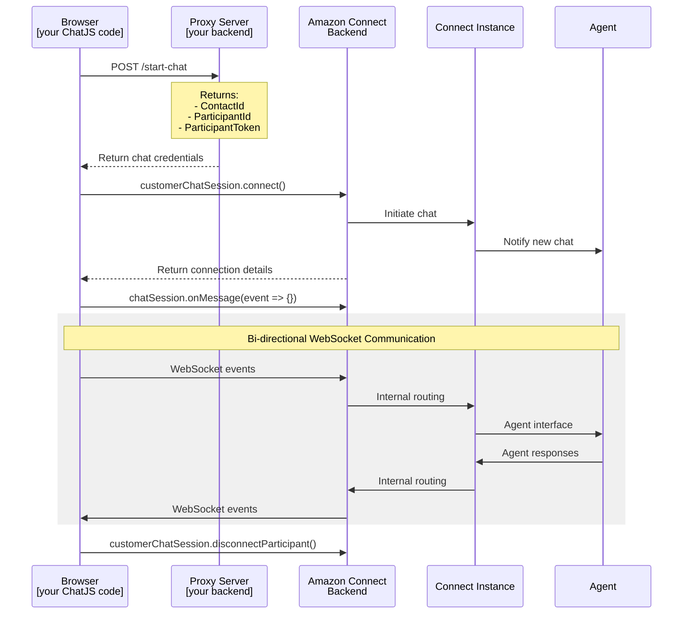

# Amazon Connect ChatJS

[](https://www.npmjs.com/package/amazon-connect-chatjs) [](https://opensource.org/licenses/Apache-2.0) [](https://www.typescriptlang.org/)

A browser-based JavaScript library for building chat interfaces for [Amazon Connect](https://docs.aws.amazon.com/connect/latest/adminguide/what-is-amazon-connect.html). Build customer chat widgets or agent interfaces with real-time WebSocket communication, TypeScript support, and [Amazon Connect Streams](https://github.com/aws/amazon-connect-streams) integration for agent UIs.

> **New to Amazon Connect?** Start with the [pre-built Hosted Widget](https://docs.aws.amazon.com/connect/latest/adminguide/add-chat-to-website.html) before customizing with this library.

## Quick Links

- [Annoucements](#announcements)
- [Getting Started](#getting-started)
- [API Reference](#api-reference)
- [Feature Documentation](#features)
- [Sample Application](#sample-application)
- [Troubleshooting](#troubleshooting)

## Announcements

- **2024-04-02**: Connection Acknowledgement (ConnAck) has migrated from [SendEvent](https://docs.aws.amazon.com/connect-participant/latest/APIReference/API_SendEvent.html) API to the [CreateParticipant](https://docs.aws.amazon.com/connect-participant/latest/APIReference/API_CreateParticipantConnection.html) API. Please upgrade to `amazon-connect-chatjs@^1.4.0` by **Dec 31, 2024**
- **2023-03-30**: Added support for _React Native environments_ (requires `amazon-connect-chatjs@^1.5.0`)
- **2022-11-08**: Added Client Side Metrics (CSM) in v1.2.0 (on by default on, disable with `.create({ disableCSM })` flag)
- **2020-12-13**: Added support for TypeScript (requires `typescript@^3.0.1` or higher)

## Getting Started

### Prerequisites

- An [AWS Account](https://aws.amazon.com/console/)
- An Amazon Connect instance set up in your account - [Create an Amazon Connect instance](https://docs.aws.amazon.com/connect/latest/adminguide/amazon-connect-instances.html)

### Installation

```sh
npm install amazon-connect-chatjs
# or
yarn add amazon-connect-chatjs
# or
pnpm add amazon-connect-chatjs
```

### Usage (Customer Chat)

Before connecting to a chat session, call [StartChatContact](https://docs.aws.amazon.com/connect/latest/APIReference/API_StartChatContact.html) API securely on your backend, returning `ContactId`, `ParticipantId`, and `ParticipantToken` to the client. Deploy this [sample CloudFormation stack](https://github.com/amazon-connect/amazon-connect-chat-ui-examples/tree/master/cloudformationTemplates/startChatContactAPI) to get started.

```js
import "amazon-connect-chatjs"; // imports the "window.connect" class

connect.ChatSession.setGlobalConfig({ region: "us-west-2" });

// Step 1: Get chat details from your backend
const response = await fetch("<url-to-personal-chat-backend>", { method: "POST" });
const chatDetails = await response.json();

// Step 2: Connect to the chat session
const customerChatSession = connect.ChatSession.create({
  chatDetails: {
    contactId: chatDetails.ContactId,
    participantId: chatDetails.ParticipantId,
    participantToken: chatDetails.ParticipantToken,
  },
  options: { region: "us-west-2" }, // optional
  type: "CUSTOMER",
});
await customerChatSession.connect();

// Step 3: Send messages and events
await customerChatSession.sendMessage({ contentType: "text/plain", message: "Hello World!" });
await customerChatSession.sendEvent({ contentType: "application/vnd.amazonaws.connect.event.typing" });

// Step 4: Handle incoming websocket events
customerChatSession.onMessage(event => { /* ... */ });
customerChatSession.onConnectionBroken(event => { /* ... */ });
customerChatSession.onEnded(event => { /* ... */ });
customerChatSession.onTyping(event => { /* ... */ });
customerChatSession.onConnectionEstablished(event => { /* ... */ });

// Step 5: End chat gracefully
await customerChatSession.disconnectParticipant();
```

#### End-to-end Flow (Customer Chat)


```mermaid
sequenceDiagram
    participant Client as Browser<br/>[your ChatJS code]
    participant Proxy as Proxy Server<br/>[your backend]
    participant Connect as Amazon Connect<br/>Backend
    participant Instance as Connect Instance
    participant Agent as Agent

    Client->>Proxy: POST /start-chat
    Note over Proxy: Returns:<br/>- ContactId<br/>- ParticipantId<br/>- ParticipantToken
    Proxy-->>Client: Return chat credentials

    Client->>Connect: customerChatSession.connect()
    Connect->>Instance: Initiate chat
    Instance->>Agent: Notify new chat
    Connect-->>Client: Return connection details

    Client->>Connect: chatSession.onMessage(event => {})

    rect rgb(240, 240, 240)
        Note over Client,Agent: Bi-directional WebSocket Communication
        Client->>Connect: WebSocket events
        Connect->>Instance: Internal routing
        Instance->>Agent: Agent interface
        Agent->>Instance: Agent responses
        Instance->>Connect: Internal routing
        Connect->>Client: WebSocket events
    end

    Client->>Connect: customerChatSession.disconnectParticipant()
```

### Usage with StreamJS (Agent Chat)

To connect and manage Agent chat sessions, use **ChatJS** and [**Streams**](https://github.com/amazon-connect/amazon-connect-streams).

> **Note:** You must allow-list your domain in Amazon Connect. See [StreamJS#allowlisting](https://github.com/amazon-connect/amazon-connect-streams?tab=readme-ov-file#allowlisting) for details, and add `http://localhost:PORT` for local testing.

Basic implementation example:

```html
<!DOCTYPE html>
<html>
<head>
  <meta charset="UTF-8">
  <script src="https://unpkg.com/amazon-connect-streams@2.18.1"></script>
  <script src="https://unpkg.com/amazon-connect-chatjs@3.0.3"></script>
</head>
<body>
  <div id="agent-control-panel" style="width: 400px; height: 800px;"></div>
  <script>
    window.onload = async function() {
      const containerDiv = document.getElementById("agent-control-panel");
      const instanceURL = "https://<INSTANCE_NAME>.my.connect.aws/ccp-v2/";
      
      try {
        await connect.core.initCCP(containerDiv, {
          ccpUrl: instanceURL,
          region: "us-west-2",
          loginPopup: true,
          softphone: { allowFramedSoftphone: true }
        });

        connect.contact(contact => {
          if (contact.getType() !== connect.ContactType.CHAT) return;

          contact.onAccepted(async () => {
            const agentConnection = contact.getConnections().find(
              conn => conn.getType() === connect.ConnectionType.AGENT
            );
            if (!agentConnection) return;

            const agentChatSession = await agentConnection.getMediaController();

            agentChatSession.onMessage(event => {
              console.log('Message received:', event.data);
            });
            // Other ChatJS events/logic ...
          });
        });
      } catch (error) {
        console.error("Error:", error);
      }
    };
  </script>
</body>
</html>
```

## Using Adjacent AWS-SDK

When using ChatJS with other AWS SDK libraries, maintain this import order:

```javascript
import 'amazon-connect-streams';     // Optional: MUST be before ChatJS
import 'amazon-connect-chatjs';      // Imports global 'window.connect'
import { ConnectClient } from '@aws-sdk/client-connect';
import { ConnectParticipantClient } from '@aws-sdk/client-connectparticipant';
```
> Note: ChatJS includes a baked-in dependency `@aws-sdk/clients/connectparticipant` (AWS SDK for Javascript v3). When using additional AWS SDK libraries, always import them after ChatJS to avoid conflicts.
> ref: [aws-sdk-connectparticipant.js](https://github.com/amazon-connect/amazon-connect-chatjs/blob/master/src/client/aws-sdk-connectparticipant.js)

## API Reference

// TODO - metadata note
// TODO - do I have all of them?
// TODO - not group properly!

### Global Properties

#### `connect.WebSocketManager`

```javascript
const wsManager = connect.WebSocketManager;
```
[Description pending]

#### `connect.ChatSession`

```javascript
const ChatSession = connect.ChatSession;
```
[Description pending]

#### `connect.LogManager`

```javascript
const logManager = connect.LogManager;
```
[Description pending]

#### `connect.LogLevel`

```javascript
const logLevel = connect.LogLevel;
```
[Description pending]

#### `connect.csmService`

```javascript
const csmService = connect.csmService;
```
[Description pending]

#### ChatSession Class

#### Static Methods

#### `connect.ChatSession.create()`

```javascript
const chatSession = await connect.ChatSession.create({
  // configuration options
});
```
[Description pending]

#### `connect.ChatSession.setGlobalConfig()`

```javascript
connect.ChatSession.setGlobalConfig({
  // global configuration options
});
```
[Description pending]

#### `connect.ChatSession.setFeatureFlag()`

```javascript
connect.ChatSession.setFeatureFlag('featureName', true);
```
[Description pending]

#### `connect.ChatSession.setRegionOverride()`

```javascript
connect.ChatSession.setRegionOverride('us-east-1');
```
[Description pending]

#### Static Properties

#### `connect.ChatSession.Logger`

```javascript
const logger = connect.ChatSession.Logger;
```
[Description pending]

#### `connect.ChatSession.LogLevel`

```javascript
const logLevel = connect.ChatSession.LogLevel;
```
[Description pending]

#### `connect.ChatSession.SessionTypes`

```javascript
const { AGENT, CUSTOMER } = connect.ChatSession.SessionTypes;
```
[Description pending]

#### `connect.ChatSession.csmService`

```javascript
const csmService = connect.ChatSession.csmService;
```
[Description pending]

### ChatSession Events

#### `chatSession.onReadReceipt()`

```javascript
chatSession.onReadReceipt(event => {
  const { chatDetails, data } = event;
  // Handle read receipt event
});
```
[Description pending]

#### `chatSession.onDeliveredReceipt()`

```javascript
chatSession.onDeliveredReceipt(event => {
  const { chatDetails, data } = event;
  // Handle delivery receipt event
});
```
[Description pending]

#### `chatSession.onConnectionEstablished()`

```javascript
chatSession.onConnectionEstablished(event => {
  const { chatDetails, data } = event;
  // Handle connection established event
});
```
[Description pending]

#### `chatSession.onEnded()`

```javascript
chatSession.onEnded(event => {
  const { chatDetails, data } = event;
  // Handle session ended event
});
```
[Description pending]

#### `chatSession.sendMessage()`

```javascript
await chatSession.sendMessage({
  // message content
});
```
[Description pending]

#### `chatSession.sendAttachment()`

```javascript
await chatSession.sendAttachment({
  // attachment data
});
```
[Description pending]

#### `chatSession.downloadAttachment()`

```javascript
const attachment = await chatSession.downloadAttachment(attachmentId);
```
[Description pending]

#### `chatSession.sendEvent()`

```javascript
await chatSession.sendEvent({
  // event data
});
```
[Description pending]

#### `chatSession.getTranscript()`

```javascript
const transcript = await chatSession.getTranscript();
```
[Description pending]

#### `chatSession.getChatDetails()`

```javascript
const details = await chatSession.getChatDetails();
```
[Description pending]

#### `chatSession.describeView()`

```javascript
const view = await chatSession.describeView();
```
[Description pending]

#### `customerChatSession.disconnectParticipant()`

```javascript
await customerChatSession.disconnectParticipant();
```

Wraps the [DisconnectParticipant](https://docs.aws.amazon.com/connect-participant/latest/APIReference/API_DisconnectParticipant.html) API.

The arguments and response do not overlap with the API request or response.

Once this method is called, the `CustomerChatSession` cannot be used anymore.

Applies only for `CustomerChatSession`. See connect.ChatSession.create() for more info.

#### `agentChatSession.cleanUpOnParticipantDisconnect()`

```javascript
await agentChatSession.cleanUpOnParticipantDisconnect();
```

Cleans up all event handlers.

Applies only for AgentChatSession. See connect.ChatSession.create() for more info.


#### `chatSession.getAuthenticationUrl()`

```javascript
const url = await chatSession.getAuthenticationUrl();
```
[Description pending]

#### `chatSession.cancelParticipantAuthentication()`

```javascript
await chatSession.cancelParticipantAuthentication();
```
[Description pending]

#### `chatSession.onParticipantIdle()`

```javascript
chatSession.onParticipantIdle(event => {
  const { chatDetails, data } = event;
  // Handle participant idle event
});
```
[Description pending]

#### `chatSession.onParticipantReturned()`

```javascript
chatSession.onParticipantReturned(event => {
  const { chatDetails, data } = event;
  // Handle participant returned event
});
```
[Description pending]

#### `chatSession.onParticipantInvited()`

```javascript
chatSession.onParticipantInvited(event => {
  const { chatDetails, data } = event;
  // Handle participant invited event
});
```
[Description pending]

#### `chatSession.onAutoDisconnection()`

```javascript
chatSession.onAutoDisconnection(event => {
  const { chatDetails, data } = event;
  // Handle auto disconnection event
});
```
[Description pending]

#### `chatSession.onConnectionLost()`

```javascript
chatSession.onConnectionLost(event => {
  const { chatDetails, data } = event;
  // Handle connection lost event
});
```
[Description pending]

#### `chatSession.onDeepHeartbeatSuccess()`

```javascript
chatSession.onDeepHeartbeatSuccess(event => {
  const { chatDetails, data } = event;
  // Handle deep heartbeat success event
});
```
[Description pending]

#### `chatSession.onDeepHeartbeatFailure()`

```javascript
chatSession.onDeepHeartbeatFailure(event => {
  const { chatDetails, data } = event;
  // Handle deep heartbeat failure event
});
```
[Description pending]

#### `chatSession.onAuthenticationInitiated()`

```javascript
chatSession.onAuthenticationInitiated(event => {
  const { chatDetails, data } = event;
  // Handle authentication initiated event
});
```
[Description pending]

#### `chatSession.onAuthenticationSuccessful()`

```javascript
chatSession.onAuthenticationSuccessful(event => {
  const { chatDetails, data } = event;
  // Handle authentication success event
});
```
[Description pending]

#### `chatSession.onAuthenticationFailed()`

```javascript
chatSession.onAuthenticationFailed(event => {
  const { chatDetails, data } = event;
  // Handle authentication failure event
});
```
[Description pending]

#### `chatSession.onAuthenticationTimeout()`

```javascript
chatSession.onAuthenticationTimeout(event => {
  const { chatDetails, data } = event;
  // Handle authentication timeout event
});
```
[Description pending]

#### `chatSession.onAuthenticationExpired()`

```javascript
chatSession.onAuthenticationExpired(event => {
  const { chatDetails, data } = event;
  // Handle authentication expired event
});
```
[Description pending]

#### `chatSession.onParticipantDisplayNameUpdated()`

```javascript
chatSession.onParticipantDisplayNameUpdated(event => {
  const { chatDetails, data } = event;
  // Handle participant display name update event
});
```
[Description pending]

#### `chatSession.onAuthenticationCanceled()`

```javascript
chatSession.onAuthenticationCanceled(event => {
  const { chatDetails, data } = event;
  // Handle authentication canceled event
});
```
[Description pending]

#### `chatSession.onChatRehydrated()`

```javascript
chatSession.onChatRehydrated(event => {
  const { chatDetails, data } = event;
  // Handle chat rehydrated event
});
```
[Description pending]

## Features

Detailed feature documentation can be found in our [docs/](docs) directory:

- [Browser Refresh Support](docs/browser-refresh-feature.md)
- [Persistent Chat](docs/persistent-chat-feature.md)
- [Attachment Scanner](docs/attachment-scanner-feature.md)
- [Client-Side Metrics (CSM)](docs/client-side-metrics.feature.md)
- [Interactive Messages](docs/interactive-messages-feature.md)
- [React Native Support](docs/ReactNativeSupport.md)

## Sample Application

See our reference implementation for Customer Chat: **[amazon-connect-chat-interface](https://github.com/amazon-connect/amazon-connect-chat-interface)**

For more implementations such as React Native and mobile, refer to **[amazon-connect/amazon-connect-chat-ui-examples](https://github.com/amazon-connect/amazon-connect-chat-ui-examples)**

## Troubleshooting

### Enable Debug Logging

```javascript
connect.ChatSession.setGlobalConfig({
  loggerConfig: {
    level: connect.LogLevel.DEBUG // INFO, WARN, ERROR
  }
});
```

### Connection Management

```javascript
chatSession.onConnectionLost(() => {
  // Implement reconnection logic
});
```

### Health Checks

```javascript
chatSession.onDeepHeartbeatSuccess(() => {
  console.log('Connection healthy');
});

chatSession.onDeepHeartbeatFailure(() => {
  console.log('Connection issues detected');
});
```

### Common Issues

#### Missing Agent Messages After Network Reconnection
**Issue**: End-customer loses network connection and agent messages fail to appear after reconnection.

**Symptoms**:
- Gap in message history
- Missing agent messages
- Network disconnection warnings

**Cause**:
When network connection is lost:
- Messages continue to be stored in Connect backend
- Client misses messages during disconnection
- Websocket reconnection alone doesn't retrieve missed messages

**Solution**:

1. Implement reconnection handling:
```javascript
const chatSession = connect.ChatSession.create({ /* ... */ });

chatSession.onConnectionEstablished(() => {
  fetchMissedMessages();
});
```

2. Fetch missed messages:
```javascript
async function fetchMissedMessages() {
  try {
    const response = await chatSession.getTranscript({
      scanDirection: "BACKWARD",
      sortOrder: "ASCENDING",
      maxResults: 15
    });
    
    const { transcript } = response.data;
    // Process and display missed messages
  } catch (error) {
    console.error("Failed to fetch transcript:", error);
  }
}
```
