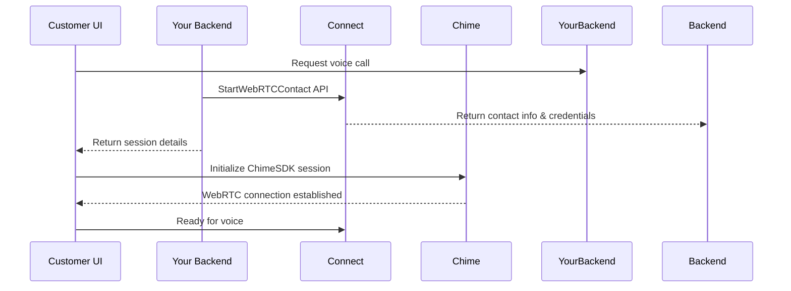

# Amazon Connect Web Calling Feature

This feature is not supported or owned by ChatJS. Please integrate [amazon-chime-sdk-js](https://github.com/aws/amazon-chime-sdk-js) to build a custom Web Calling UI. For Agent sessions in **Custom CCP**, refer to this example: https://github.com/amazon-connect/amazon-connect-in-app-calling-examples which uses [`connect-rtc-js`]https://github.com/aws/connect-rtc-js)

### Implementation Steps



1. Backend Setup

```typescript
// import javascript AWS SDK

 // Lambda or server endpoint
  async function startVoiceCall(request) {
    const connect = new AWS.Connect();

    const params = {
      InstanceId: 'your-connect-instance-id',
      ContactFlowId: 'your-flow-id',
      Attributes: {
        // Custom attributes
      },
      // Other parameters like queue
    };

    const response = await connect.startWebRTCContact(params).promise();
    return {
      contactId: response.ContactId,
      credentials: response.Credentials,
      webSocketUrl: response.WebSocketUrl
    };
  }
```


2. Frontend Integration
```typescript
  import {
    ConsoleLogger,
    DefaultDeviceController,
    MeetingSessionConfiguration
  } from 'amazon-chime-sdk-js';

  class VoiceCallManager {
    private chimeSession: any;

    async initializeCall() {
      // 1. Get session details from backend
      const sessionDetails = await this.backend.startVoiceCall();

      // 2. Initialize Chime SDK
      const logger = new ConsoleLogger();
      const deviceController = new DefaultDeviceController(logger);

      // 3. Configure meeting
      const configuration = new MeetingSessionConfiguration(
        sessionDetails.credentials,
        sessionDetails.webSocketUrl
      );

      // 4. Create session
      this.chimeSession = new DefaultMeetingSession(
        configuration,
        logger,
        deviceController
      );

      // 5. Start audio
      await this.chimeSession.audioVideo.start();
    }

    async endCall() {
      if (this.chimeSession) {
        await this.chimeSession.audioVideo.stop();
      }
    }
  }
```

3. UI Components
```typescript
  interface VoiceCallProps {
    onCallEnd: () => void;
  }

  const VoiceCallUI: React.FC<VoiceCallProps> = ({ onCallEnd }) => {
    const [audioInputs, setAudioInputs] = useState<MediaDeviceInfo[]>([]);
    const [selectedInput, setSelectedInput] = useState<string>();
    const [isMuted, setIsMuted] = useState(false);

    // Device selection
    const listAudioInputs = async () => {
      const devices = await voiceManager.chimeSession.audioVideo
        .listAudioInputDevices();
      setAudioInputs(devices);
    };

    // Audio controls
    const toggleMute = async () => {
      if (isMuted) {
        await voiceManager.chimeSession.audioVideo.realtimeUnmuteLocalAudio();
      } else {
        await voiceManager.chimeSession.audioVideo.realtimeMuteLocalAudio();
      }
      setIsMuted(!isMuted);
    };

    return (
      <div className="voice-call-container">
        <DeviceSelector
          devices={audioInputs}
          onChange={setSelectedInput}
        />
        <CallControls
          onMute={toggleMute}
          onEnd={onCallEnd}
          isMuted={isMuted}
        />
        <AudioMetrics /> {/* Show audio levels, connection quality */}
      </div>
    );
  };
```

4. Error Handling & Events
```typescript
  class VoiceCallManager {
    private setupEventListeners() {
      this.chimeSession.audioVideo.addObserver({
        // Connection events
        connectionDidBecomePoor: () => {
          this.emit('poorConnection');
        },
        connectionDidSuggestStopVideo: () => {
          this.emit('connectionIssue');
        },

        // Audio events
        audioInputFailed: (error: Error) => {
          this.handleAudioFailure(error);
        },

        // Volume indicators
        volumeDidChange: (attendeeId: string, volume: number) => {
          this.updateVolumeIndicator(attendeeId, volume);
        }
      });
    }

    private handleAudioFailure(error: Error) {
      // Implement retry logic
      // Notify user
      // Log error
    }
  }
```

5. Best Practices
```typescript
  class VoiceCallManager {
    // Pre-call checks
    async validateDevices() {
      const permissions = await navigator.mediaDevices.getUserMedia({
        audio: true
      });
      return !!permissions;
    }

    // Bandwidth monitoring
    private monitorConnection() {
      setInterval(async () => {
        const metrics = await this.chimeSession.audioVideo
          .getRTCPeerConnectionStats();
        this.analyzeMetrics(metrics);
      }, 5000);
    }

    // Cleanup
    async cleanup() {
      await this.chimeSession?.audioVideo?.stop();
      await this.chimeSession?.deviceController?.destroy();
    }
  }
```
