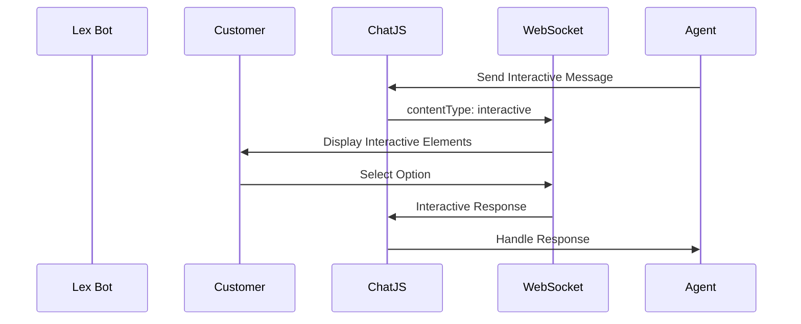

# Interactive Messages Documentation

Reference: https://docs.aws.amazon.com/connect/latest/adminguide/interactive-messages.html



1. Handling Responses (Agent)

```js
 chatSession.onMessage((message) => {
      if (message.contentType === "application/vnd.amazonaws.connect.message.interactive.response") {
          const response = JSON.parse(message.content);
          const selectedOption = response.data.elementId; // e.g., "order_status"
          handleCustomerSelection(selectedOption);
      }
  });
```

2. Some Available Templates

▷ Quick Reply Template
```typescript
  const quickReplyTemplate = {
      templateType: "QuickReply",
      version: "1.0",
      data: {
          title: "Select an option:",
          elements: [
              {
                  title: "Option 1",
                  id: "opt1"
              }
          ]
      }
  };
```

▷ List Picker Template
```typescript

  const listPickerTemplate = {
      templateType: "ListPicker",
      version: "1.0",
      data: {
          title: "Available Products",
          subtitle: "Select a product to learn more",
          elements: [
              {
                  title: "Product A",
                  subtitle: "Details about Product A",
                  id: "prod_a"
              }
          ]
      }
  };
```

▷ Time Picker Template
```typescript
  const timePickerTemplate = {
      templateType: "TimePicker",
      version: "1.0",
      data: {
          title: "Select appointment time",
          timezone: "America/Los_Angeles",
          startTime: "2024-02-01T09:00",
          endTime: "2024-02-01T17:00",
          intervalMinutes: 30
      }
  };
```

3. Send reply

```typescript
// Use regular sendMessage() with interactive.response contentType
await chatSession.sendMessage({
    message: JSON.stringify(response),
    contentType: "application/vnd.amazonaws.connect.message.interactive.response"
});
```
